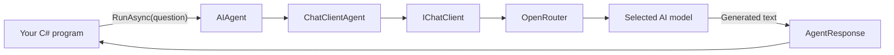
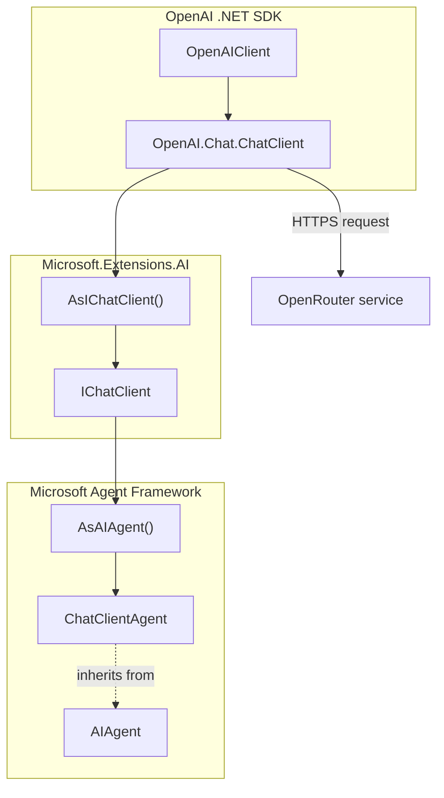

# Video 01 — Create your first agent

## The idea in one sentence

An `AIAgent` gives your application one simple object for sending work to an AI model and receiving a response.

This lesson teaches only that idea: create one agent and run it once.

## What problem does it solve?

A model provider gives us a client that can send chat requests. That is useful, but an application usually wants to describe an AI capability such as a support assistant, code reviewer, or document helper.

Microsoft Agent Framework puts an agent abstraction in front of the model client. Your application can ask the agent to do work without knowing every provider-specific detail.

## A simple mental model

Think of the chat client as a telephone connection to the model.

The agent is the person using that telephone. It has a name and instructions describing its job. Your application talks to the agent, and the agent uses the connection to reach the model.

## The complete flow



Creating the agent does not contact the model. The network request happens when the program calls `RunAsync`.

## The important pieces

| Piece | What it does | Where it comes from |
|---|---|---|
| `OpenAIClient` | Creates an OpenAI-compatible model client pointed at OpenRouter | OpenAI .NET SDK |
| `IChatClient` | Gives .NET code a provider-neutral chat interface | Microsoft.Extensions.AI |
| `AIAgent` | Gives application code a common agent abstraction | Microsoft Agent Framework |
| `ChatClientAgent` | Implements `AIAgent` by using an `IChatClient` | Microsoft Agent Framework |
| `AgentResponse` | Contains the result returned by the agent | Microsoft Agent Framework |
| OpenRouter | Sends the request to the selected model | External service |

## Where the types live



The important boundary is `IChatClient`. The OpenAI SDK side knows how to communicate with an OpenAI-compatible endpoint. Agent Framework works with the common chat interface and does not need OpenRouter-specific agent code.

## Before running the example

Set two environment variables in PowerShell:

```powershell
$env:OPENROUTER_API_KEY = "<your-key>"
$env:OPENROUTER_MODEL = "<provider/model>"
```

Use an OpenRouter model identifier for `OPENROUTER_MODEL`. Never place the real API key in source code or show it during a recording.

## Code walkthrough

The complete program is in [Example/Program.cs](Example/Program.cs).

### 1. Import the required namespaces

```csharp
using System.ClientModel;
using Microsoft.Agents.AI;
using Microsoft.Extensions.AI;
using OpenAI;
```

- `System.ClientModel` provides `ApiKeyCredential`.
- `OpenAI` provides `OpenAIClient` and its configuration.
- `Microsoft.Extensions.AI` provides `IChatClient` and the adapter extension methods.
- `Microsoft.Agents.AI` provides `AIAgent`, `AsAIAgent`, and `AgentResponse`.

These namespaces are mixed deliberately because the program connects an external model SDK to Agent Framework.

### 2. Read configuration

```csharp
string apiKey = Environment.GetEnvironmentVariable("OPENROUTER_API_KEY")
    ?? throw new InvalidOperationException("OPENROUTER_API_KEY is not set.");
string model = Environment.GetEnvironmentVariable("OPENROUTER_MODEL")
    ?? throw new InvalidOperationException("OPENROUTER_MODEL is not set.");
```

The values come from the environment instead of source code. The program stops with a useful message if either value is missing.

### 3. Create the provider client

```csharp
OpenAIClient openAIClient = new(
    new ApiKeyCredential(apiKey),
    new OpenAIClientOptions
    {
        Endpoint = new Uri("https://openrouter.ai/api/v1")
    });
```

`OpenAIClient` normally speaks to an OpenAI-compatible API. Setting `Endpoint` directs those requests to OpenRouter. This object is not yet an Agent Framework agent.

### 4. Create the common chat client

```csharp
IChatClient chatClient = openAIClient
    .GetChatClient(model)
    .AsIChatClient();
```

`GetChatClient(model)` selects the configured OpenRouter model. `AsIChatClient()` adapts the OpenAI SDK client to the common `IChatClient` interface used by Agent Framework.

### 5. Create the agent

```csharp
AIAgent agent = chatClient.AsAIAgent(
    instructions: "Explain the requested AI concept in one short sentence for a .NET developer.",
    name: "DotNetTeacher");
```

`AsAIAgent()` creates a `ChatClientAgent` around the chat client. We store it as `AIAgent` because that is the common abstraction application code can use.

The instructions describe the agent's job. The name makes the agent easier to identify. Creating it still does not send a model request.

### 6. Run the agent

```csharp
AgentResponse response = await agent.RunAsync("What is an AI agent?");
```

`RunAsync` receives the user's text. Agent Framework turns that text into a user message, combines it with the instructions, and asks the chat client for a response.

The call is asynchronous because it performs a network request.

### 7. Display the result

```csharp
Console.WriteLine(response.Text);
```

`AgentResponse` can hold more than text, but this first lesson needs only its `Text` property.

## Run it

From the lesson directory:

```powershell
dotnet run --project Example/Example.csproj
```

The wording can change because the model generates the answer. The output should look similar to:

```text
An AI agent is a model-powered component that follows instructions to perform a task for your application.
```

## What happens inside Agent Framework?

The short version is:

1. `AsAIAgent()` creates a `ChatClientAgent`.
2. `RunAsync(string)` turns the string into a user `ChatMessage`.
3. The agent adds its instructions to the chat options.
4. The agent calls `IChatClient.GetResponseAsync(...)`.
5. It converts the returned chat response into an `AgentResponse`.

The framework also prepares extension points for tools, sessions, middleware, and other capabilities. We intentionally do not use those features in this lesson.

## When should I use an agent?

Use an agent when your application has a named AI capability with a particular job or set of instructions. Starting with `AIAgent` also gives you a consistent place to add more Agent Framework capabilities later.

## When might a chat client be enough?

For one small, stateless model call with no agent behavior, calling `IChatClient` directly may be simpler.

An agent also does not make generated text automatically correct or safe. Important output still needs appropriate validation.

## Recap

- `OpenAIClient` connects to OpenRouter.
- `IChatClient` is the common model-client boundary.
- `AsAIAgent()` wraps that client in a `ChatClientAgent`.
- Application code works through `AIAgent`.
- `RunAsync` sends the request and returns an `AgentResponse`.

## Next lesson

Video 02 will focus on `AIAgent` itself: what the abstraction represents and why different agent implementations can share the same run interface.

See [sources.md](sources.md) for the framework implementation, sample, test, and compatibility references used to verify this lesson.
