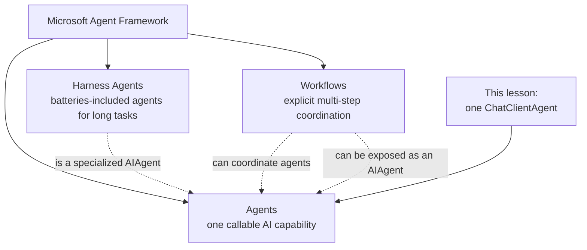
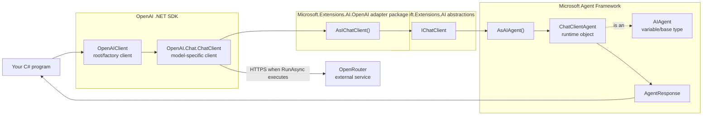
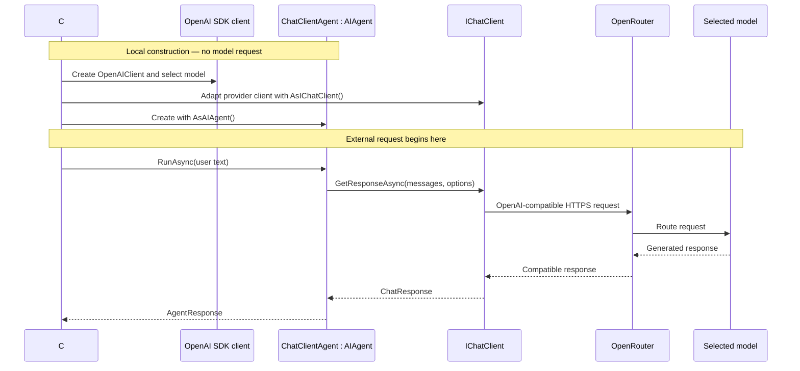

# Video 01 — Meet Microsoft Agent Framework and create your first agent

## What you will learn

By the end of this lesson, you will understand what Microsoft Agent Framework is, what kinds of applications it can grow into, and how to create its smallest useful agent in C#.

The code demonstrates one intentionally small path:

```text
OpenAI SDK client → IChatClient → ChatClientAgent (used as AIAgent)
```

Everything else in this README gives you the map around that first step.

## What is Microsoft Agent Framework?

Microsoft Agent Framework is an open framework for building AI agents and multi-agent workflows in .NET and Python. It gives application code a consistent way to create agents, run them, give them tools and context, coordinate multi-step work, and add operational features needed beyond a prototype.

It is important to separate the framework from the model:

- **OpenRouter** routes the compatible request to the selected model.
- **The selected model** generates the response.
- **A model SDK** knows how to communicate with that model endpoint.
- **Microsoft Agent Framework** gives your application agent abstractions, execution patterns, state, composition, and extension points around model access.

The framework does not make the model smarter. It gives developers a structured way to build software around the model.

## Why use a framework instead of only a model client?

A raw model client solves one problem: send input to a model and receive output.

An agent application usually grows beyond that first call. It may need richer agent behavior such as tools, conversations, memory, or RAG; controlled coordination between code, people, and agents; and operational support such as safety, approvals, telemetry, and evaluation.

Microsoft Agent Framework provides a common foundation for adding those capabilities without inventing a new application structure for each one.

## The framework map

At the highest level, Microsoft Agent Framework has three ideas to keep separate:



| Concept | Simple meaning | Example use |
|---|---|---|
| **Agent** | One callable AI capability behind the common `AIAgent` base abstraction | A support assistant that can answer questions and call support tools |
| **Workflow** | An explicit graph of code or agent steps connected in an order you control | Triage an incident, request human approval, then run remediation |
| **Harness Agent** | An opinionated `AIAgent` with scaffolding for long interactive tasks | A coding or research agent that tracks todos, uses tools, manages context, and can use configured bounded loops to keep progressing |

These concepts can work together, but they are not the same thing. A workflow is useful when your code should control the path. A Harness Agent is useful when an agent needs built-in support for longer, tool-driven work.

## Capability roadmap

This first video does not teach all these capabilities. It shows where the series is heading.

| Capability area | What it adds |
|---|---|
| **Model connections** | Connect application-owned agents to different model providers through common abstractions |
| **Messages and responses** | Regular runs, streaming, multimodal content, and structured output |
| **Sessions and context** | Multi-turn conversations and relevant runtime information |
| **Memory and RAG** | Recall stored information and retrieve knowledge to ground an answer |
| **Tools and MCP** | Let an agent call C# functions or capabilities exposed by external MCP servers |
| **Middleware and operations** | Add cross-cutting behavior, observability, evaluation, approvals, and safety controls |
| **Workflows and multi-agent orchestration** | Coordinate agents, code, state, human input, checkpoints, and controlled execution paths |
| **Harness Agents** | Assemble planning, todos, memory, skills, compaction, approvals, and optional looping or delegation for longer work |
| **Hosting and protocols** | Expose agents and integrate with other systems or agents |

Later videos will teach these one small concept at a time.

## Where today's example fits

Today we use only the smallest Agent path:

- One model connection through OpenRouter.
- One set of instructions.
- One user message.
- One returned response.

The example has **no tools, session, external memory, RAG, MCP, workflow, multi-agent communication, or autonomous loop**. A single `RunAsync` call should not be mistaken for the entire framework.

## A .NET mental model

Think of the layers like an application service built over a lower-level client:

```text
Your application
    uses AIAgent                         application-facing contract
        runtime object: ChatClientAgent Agent Framework implementation
            uses IChatClient             provider-neutral model boundary
                wraps OpenAI SDK client  endpoint-specific communication
                    calls OpenRouter      external model service
```

`IChatClient` is similar to a client interface that hides transport-specific details. `ChatClientAgent` adds the agent's identity, instructions, session/run contract, and Agent Framework pipeline around that client.

## The objects in this example



There are not two agent objects in this diagram. `AsAIAgent()` creates one `ChatClientAgent`; the program stores that object in a variable whose type is the base abstraction `AIAgent`.

## Which package owns each piece?

The project directly references one integration package:

```xml
<PackageReference Include="Microsoft.Agents.AI.OpenAI" Version="1.19.0" />
```

That package brings the required Agent Framework and OpenAI adapter dependencies into the project. This is why the program can use types from several namespaces with one direct package reference.

| Code element | Owner/package role |
|---|---|
| `ApiKeyCredential` | `System.ClientModel`; represents the API credential |
| `OpenAIClient` and `OpenAI.Chat.ChatClient` | OpenAI .NET SDK; create the OpenAI-compatible provider clients |
| `AsIChatClient()` | `Microsoft.Extensions.AI.OpenAI` adapter package; adapts the provider client |
| `IChatClient` | Microsoft.Extensions.AI abstraction; common chat-client contract |
| `AsAIAgent()` and `ChatClientAgent` | Microsoft Agent Framework; create and implement the chat-client-backed agent |
| `AIAgent` and `AgentResponse` | Microsoft Agent Framework abstractions; common run contract and response |
| OpenRouter | External service; routes the OpenAI-compatible request to the selected model |

## Before running the example

Set these environment variables in PowerShell:

```powershell
$env:OPENROUTER_API_KEY = "<your-key>"
$env:OPENROUTER_MODEL = "<provider/model>"
```

Use a valid OpenRouter model identifier. Never place a real API key in the code, a commit, or a video recording.

## Code walkthrough

The complete program is in [Example/Program.cs](Example/Program.cs).

### 1. Import the namespaces

```csharp
using System.ClientModel;
using Microsoft.Agents.AI;
using Microsoft.Extensions.AI;
using OpenAI;
```

These namespaces reveal the layers we just mapped:

- `System.ClientModel` supplies the credential type.
- `OpenAI` supplies the provider SDK client.
- `Microsoft.Extensions.AI` is the namespace used for both the common chat abstraction and the adapter extension in this code. Namespace and NuGet package ownership are different: `IChatClient` comes from the abstractions package, while the OpenAI-specific `AsIChatClient()` adapter comes from `Microsoft.Extensions.AI.OpenAI`.
- `Microsoft.Agents.AI` supplies the Agent Framework types.

No work happens at runtime merely because a namespace is imported.

### 2. Read configuration safely

```csharp
string apiKey = Environment.GetEnvironmentVariable("OPENROUTER_API_KEY")
    ?? throw new InvalidOperationException("OPENROUTER_API_KEY is not set.");
string model = Environment.GetEnvironmentVariable("OPENROUTER_MODEL")
    ?? throw new InvalidOperationException("OPENROUTER_MODEL is not set.");
```

The API key and model name stay outside source code. If either variable is absent, the program stops immediately with a clear message instead of failing later during a model request.

### 3. Point the OpenAI-compatible SDK at OpenRouter

```csharp
OpenAIClient openAIClient = new(
    new ApiKeyCredential(apiKey),
    new OpenAIClientOptions
    {
        Endpoint = new Uri("https://openrouter.ai/api/v1")
    });
```

`OpenAIClient` is the OpenAI SDK's root client. `ApiKeyCredential` supplies authentication. Changing `Endpoint` means the compatible SDK will send requests to OpenRouter rather than the OpenAI service.

This creates a local client object. It does not send a request or spend model tokens.

### 4. Select the model and create `IChatClient`

```csharp
IChatClient chatClient = openAIClient
    .GetChatClient(model)
    .AsIChatClient();
```

Two things happen here:

1. `GetChatClient(model)` creates an `OpenAI.Chat.ChatClient` for the chosen OpenRouter model.
2. `AsIChatClient()` adapts it to the provider-neutral `IChatClient` interface.

Agent Framework can now depend on `IChatClient` rather than on provider-specific application code. No network request has been made yet.

### 5. Create the agent

```csharp
AIAgent agent = chatClient.AsAIAgent(
    instructions: "Explain the requested AI concept in one short sentence for a .NET developer.",
    name: "DotNetTeacher");
```

`AsAIAgent()` creates one `ChatClientAgent` around the `IChatClient`. That concrete object is stored in a variable typed as `AIAgent`.

- `instructions` describe the agent's job and expected style.
- `name` gives the capability an identity that logs, hosts, or application code can recognize.

Creating the agent configures local objects. It still does not call the model.

### 6. Run the agent

```csharp
AgentResponse response = await agent.RunAsync("What is an AI agent?");
```

This is the line that starts the model request.

Agent Framework receives the user text through its common run interface. The `ChatClientAgent` prepares the user message and instructions, then calls its `IChatClient`. The call is asynchronous because it performs external I/O.

### 7. Read the response

```csharp
Console.WriteLine(response.Text);
```

Agent Framework returns an `AgentResponse`. It can contain richer message content, but this lesson uses only the generated text.

Model output can vary and should be treated as untrusted data when it affects important application behavior.

## Build and run

From the lesson directory:

```powershell
dotnet build Example/Example.csproj
dotnet run --project Example/Example.csproj
```

The response wording may change. It should look similar to:

```text
An AI agent is a model-powered component that follows instructions to perform a task for your application.
```

## Construction flow versus request flow



This distinction matters: object construction configures the path; `RunAsync` uses it.

## What Agent Framework does internally for this run

For this specific example:

1. `AsAIAgent()` constructs a `ChatClientAgent` around the supplied `IChatClient`.
2. `RunAsync(string)` converts the string into a user `ChatMessage`.
3. The agent combines its configured instructions with the run's messages and options.
4. It calls `IChatClient.GetResponseAsync(...)`.
5. It converts the returned `ChatResponse` into `AgentResponse`.

That is all the viewer needs for the first lesson. Later lessons will open the same pipeline to add sessions, tools, context, middleware, and other behavior.

## When should I start with an agent?

Use `AIAgent` when your application is defining a named AI capability with instructions and may later need other Agent Framework features or participate in orchestration.

A direct `IChatClient.GetResponseAsync(...)` call can be enough for a tiny, stateless model request that does not benefit from the agent abstraction.

## Recap

- Microsoft Agent Framework is the application framework around model access; it is not the model provider.
- Its three high-level ideas are Agents, Workflows, and Harness Agents.
- This lesson uses one `ChatClientAgent`, referenced through `AIAgent`.
- The provider SDK connects to OpenRouter and is adapted to `IChatClient`.
- Creating clients and the agent is local; `RunAsync` starts the external request.
- The small example is the first building block, not the framework's full capability set.

## Next lesson

Video 02 will focus on `AIAgent`: what the common abstraction represents and why different agent implementations can share the same run and session contract.

See [sources.md](sources.md) for the exact framework source, samples, tests, and official overview pages used to verify this lesson.
