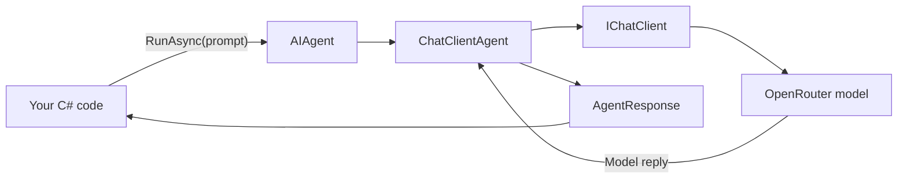
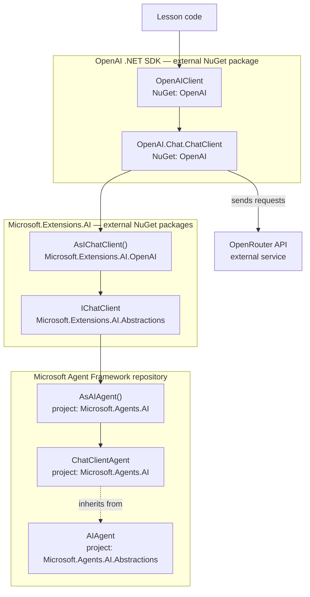

# Lesson 01 — Creating an agent

This lesson shows how to create and run an `AIAgent`.

An agent combines three things:

- A model client.
- Instructions that describe its job.
- A simple API for sending requests and receiving responses.

## What problem does this solve?

Every AI provider has its own client and configuration. If provider code is spread across your application, it becomes difficult to change or reuse.

Microsoft Agent Framework places an `AIAgent` in front of the provider client. The rest of your application can work with the agent instead of depending directly on provider details.

## The big picture



The important idea is simple: your code talks to `AIAgent`. The agent handles the model client for you.

## Important types

- `AIAgent` is the common base class for agents. You call `RunAsync` on it.
- `IChatClient` is the common interface used to call a chat model.
- `ChatClientAgent` is an `AIAgent` that uses an `IChatClient`.
- `AsIChatClient()` converts the OpenAI SDK client into `IChatClient`.
- `AsAIAgent(...)` converts `IChatClient` into `ChatClientAgent`.
- `AgentResponse` contains the agent's result. Use `Text` for the text response.

## Where do these types live?

Not every type in the example belongs to Microsoft Agent Framework.



The key boundary is `IChatClient`:

- `OpenAIClient` and `OpenAI.Chat.ChatClient` come from the external OpenAI .NET SDK. They are configured to send requests to OpenRouter.
- `IChatClient` and `AsIChatClient()` come from Microsoft.Extensions.AI packages. Agent Framework uses these packages, but they are separate from Agent Framework.
- `AIAgent`, `ChatClientAgent` and `AsAIAgent()` are part of Microsoft Agent Framework.
- `OpenRouter` is the external model service. It is not part of Microsoft Agent Framework.

## OpenRouter setup

Both examples use OpenRouter. Set these environment variables before running them:

```powershell
$env:OPENROUTER_API_KEY = "<your-key>"
$env:OPENROUTER_MODEL = "<provider/model>"
```

`OPENROUTER_MODEL` must contain an OpenRouter model identifier. Choose one from the OpenRouter model catalog.

The examples use `https://openrouter.ai/api/v1`, which OpenRouter documents as its OpenAI-compatible base URL in the [official quickstart](https://openrouter.ai/docs/quickstart).

Never put an API key directly in source code.

## Example 1 — Concept Explorer

[BasicExample](BasicExample) contains only the code needed to:

1. Connect the OpenAI .NET SDK to OpenRouter.
2. Convert the model client into `IChatClient`.
3. Create an `AIAgent`.
4. Run the agent once.

Run it from the lesson directory:

```powershell
dotnet run --project BasicExample/BasicExample.csproj
```

The output will have this shape:

```text
Agent: ConceptExplorer
Response: <a short model-generated sentence>
```

## Example 2 — Practical Example

[PracticalExample](PracticalExample) creates an incident-triage agent.

The agent reads an incident description and returns:

- A severity.
- A short reason.
- The next action to take.

Run it from the lesson directory:

```powershell
dotnet run --project PracticalExample/PracticalExample.csproj
```

The exact words may change because model output is not deterministic.

## Execution flow

When the program runs:

1. `OpenAIClient` is configured to use OpenRouter.
2. `GetChatClient(model)` selects the model from `OPENROUTER_MODEL`.
3. `AsIChatClient()` creates the common chat-client interface.
4. `AsAIAgent(...)` creates a `ChatClientAgent` and stores its instructions and name.
5. `RunAsync(...)` sends the user message to the model.
6. The model reply is returned as an `AgentResponse`.

Creating the agent does not call the model. The model is called only when you use `RunAsync`.

## What happens inside the framework?

`AsAIAgent(...)` creates a `ChatClientAgent` around the supplied `IChatClient`.

When you call `RunAsync(string)`:

1. The string becomes a user `ChatMessage`.
2. The agent adds its instructions.
3. The agent calls `IChatClient.GetResponseAsync(...)`.
4. The returned `ChatResponse` becomes an `AgentResponse`.

The framework also prepares support for features such as sessions, tools and telemetry. Those features are covered in later lessons.

## When should I use it?

Use an `AIAgent` when your application needs a named AI capability with clear instructions.

It is a good starting point if you may later add:

- Conversation sessions.
- Tools.
- Memory or extra context.
- Middleware.
- Workflows.

## When should I probably not use it?

A direct `IChatClient.GetResponseAsync(...)` call may be enough for one small, stateless model request.

Also remember that an agent does not make model output automatically correct or safe. Validate important results and treat model output as untrusted input.

## Explore the implementation

In the upstream Microsoft Agent Framework repository, read these files in order:

1. `dotnet/src/Microsoft.Agents.AI/ChatClient/ChatClientExtensions.cs`
2. `dotnet/src/Microsoft.Agents.AI.Abstractions/AIAgent.cs`
3. `dotnet/src/Microsoft.Agents.AI/ChatClient/ChatClientAgent.cs`

In `ChatClientAgent.cs`, find `PrepareSessionAndMessagesAsync` and `RunCoreAsync`. They show how the request is prepared and sent to `IChatClient`.

See [sources.md](sources.md) for the full list of source files, samples and tests used for this lesson.
