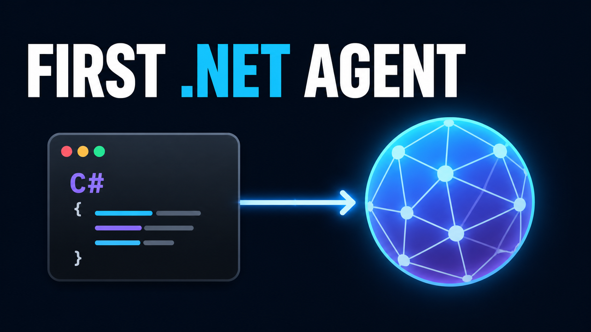

# YouTube publishing details

## Title

Microsoft Agent Framework for .NET — Build Your First Agent

## Description

What is Microsoft Agent Framework, and where does your first C# agent fit?

In this beginner-friendly .NET lesson, we first build a simple map of Microsoft Agent Framework. You will see the difference between Agents, Workflows, and the official Harness Agent, along with the larger capabilities the series will cover—including tools, MCP, memory, RAG, multi-agent orchestration, and observability.

Then we create one intentionally small `AIAgent` in C#. The example connects an OpenAI-compatible client to OpenRouter, adapts it to `IChatClient`, creates a `ChatClientAgent`, and calls `RunAsync`. Every important code block is explained so you know what it creates, why it exists, which package owns it, and what happens at runtime.

Prerequisites:

- Basic C# and `async`/`await`
- .NET 10 SDK
- An OpenRouter API key
- An OpenRouter model identifier

Example source:

https://github.com/SunilPrasad/ai-agent/tree/master/01-creating-an-agent

Next video: What `AIAgent` represents and why Agent Framework uses a common base abstraction.

## Chapters

```text
00:00 Preview the first agent
00:35 What is Microsoft Agent Framework?
01:50 Agents, Workflows, and Harness Agents
02:55 Where this small example fits
03:30 Package and object boundaries
04:05 Explain the C# code
07:15 Run the agent
08:00 What happens inside the framework
09:05 Recap and next lesson
```

## Thumbnail



### Brief

A minimal dark developer-education thumbnail showing a small C# code window flowing into one abstract agent node. Large text reads “FIRST .NET AGENT”. The image communicates only the first code-to-agent step and deliberately avoids provider logos or advanced framework features.

### Accessibility alt text

Dark blue thumbnail with the words “FIRST .NET AGENT”, a small C# code window, and an arrow pointing to a glowing abstract network node.
