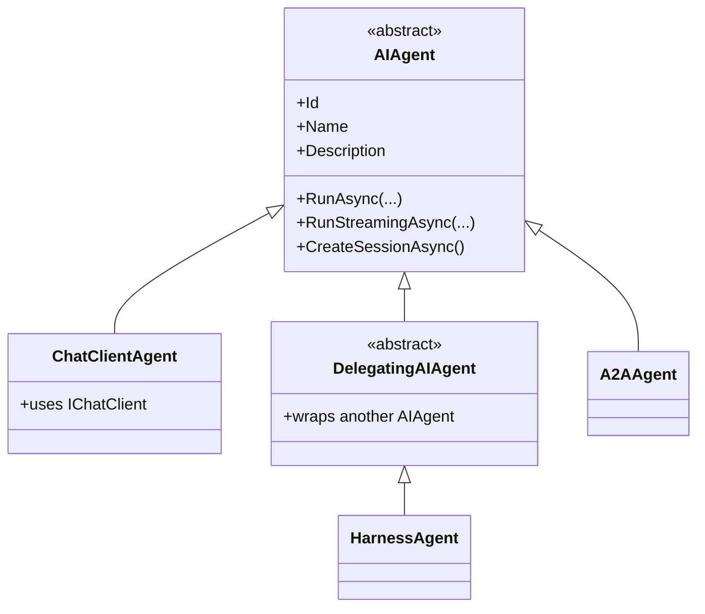
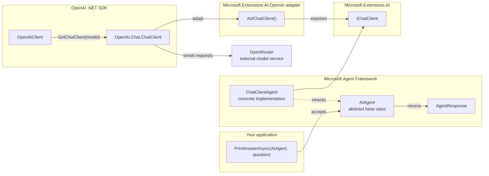
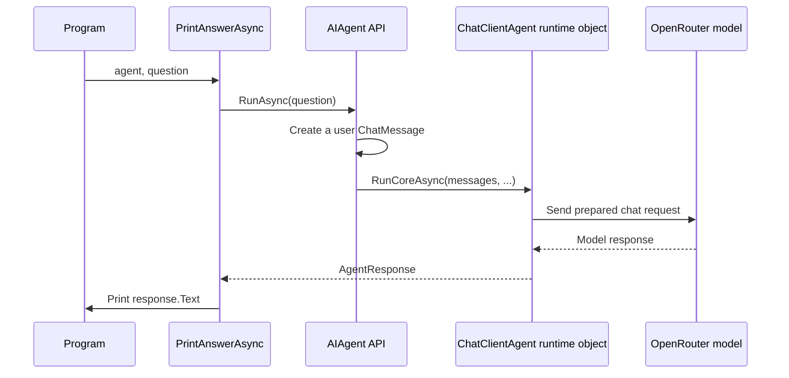

# Video 02 — What `AIAgent` represents

## The idea in one sentence

`AIAgent` is the common abstract base class that lets .NET application code run an agent without depending on that agent's concrete implementation.

This lesson answers one question: **why is our variable typed as `AIAgent` when the object created at runtime is a `ChatClientAgent`?**

## The problem it solves

Imagine a method that can only accept `ChatClientAgent`:

```csharp
static Task PrintAnswerAsync(ChatClientAgent agent, string question)
```

That method is tied to one kind of agent. It cannot accept another Agent Framework implementation, even when that implementation can also run the same question.

Agent Framework needs a shared type for the behavior that agents have in common. In C#, that type is the abstract class `AIAgent`. Application code can accept `AIAgent` and call its common operations, such as `RunAsync`, without knowing how the concrete agent performs the work.

## A .NET mental model

Think about a method that accepts `Stream`. The object passed to it might be a `FileStream` or a `MemoryStream`, but the method only needs the operations promised by `Stream`.

`AIAgent` plays a similar role:

```text
Stream                   AIAgent
  └─ FileStream            └─ ChatClientAgent
```

The analogy is about polymorphism, not about files. Your method depends on the common base class. The runtime object supplies the specific behavior.

## Base class and runtime object



The diagram does **not** mean all agents work the same way internally. It means they share the application-facing operations defined by `AIAgent`.

In this lesson:

- The variable and method parameter are typed as `AIAgent`.
- The runtime object is a `ChatClientAgent`.
- `ChatClientAgent` sends requests through an `IChatClient`.

`AIAgent` is an abstract class, so you do not create it with `new AIAgent()`. You create or receive a concrete derived agent and work with it through the base type.

## What `AIAgent` does — and does not — represent

`AIAgent` represents the common **agent contract** in Agent Framework. Today we need only two parts: `Name` identifies the agent, and `RunAsync(...)` runs it. The base class also provides common entry points for streaming and conversation sessions, but those get their own later videos.

`AIAgent` is not:

- The AI model.
- The OpenRouter service.
- The OpenAI SDK client.
- The chat-client abstraction.
- Always a `ChatClientAgent`.

That separation is the reason application services and orchestration code can be written against one agent type.

## Who owns each type?



| Type or service | Owner | Job in this example |
|---|---|---|
| `AIAgent`, `ChatClientAgent`, `AgentResponse`, `AsAIAgent()` | Microsoft Agent Framework | Represent, create, and run the agent |
| `IChatClient` | Microsoft.Extensions.AI abstractions | Provide the common chat-model client boundary |
| `AsIChatClient()` | Microsoft.Extensions.AI.OpenAI adapter package | Adapt `OpenAI.Chat.ChatClient` to `IChatClient` |
| `OpenAIClient`, `OpenAIClientOptions`, `OpenAI.Chat.ChatClient` | OpenAI .NET SDK | Configure the compatible endpoint and create a model-specific chat client |
| `ApiKeyCredential` | System.ClientModel | Hold the API credential passed to the SDK |
| OpenRouter | External service | Route the request to the configured model |

The lesson's main boundary is the left side: `PrintAnswerAsync` knows only about `AIAgent`. Video 03 explains the chat-client and provider side in detail.

## Run the example

Set the two environment variables in PowerShell:

```powershell
$env:OPENROUTER_API_KEY = "<your-key>"
$env:OPENROUTER_MODEL = "<provider/model>"
```

Then run:

```powershell
dotnet run --project Example/Example.csproj
```

Never put a real API key in source code or show it in a recording.

This portable example uses the released `Microsoft.Agents.AI.OpenAI` NuGet package. The lesson was researched and separately compiled against the exact framework source commit recorded in [`sources.md`](sources.md).

## Code walkthrough

The complete example is in [`Example/Program.cs`](Example/Program.cs).

### 1. Read configuration

```csharp
string apiKey = Environment.GetEnvironmentVariable("OPENROUTER_API_KEY")
    ?? throw new InvalidOperationException("OPENROUTER_API_KEY is not set.");
string model = Environment.GetEnvironmentVariable("OPENROUTER_MODEL")
    ?? throw new InvalidOperationException("OPENROUTER_MODEL is not set.");
```

These lines read the OpenRouter credential and model name from the environment. The `?? throw` expressions stop immediately with a useful message when either setting is missing.

### 2. Create the chat client

```csharp
IChatClient chatClient = new OpenAIClient(
        new ApiKeyCredential(apiKey),
        new OpenAIClientOptions { Endpoint = new Uri("https://openrouter.ai/api/v1") })
    .GetChatClient(model)
    .AsIChatClient();
```

This setup is carried over from Video 01 so the example can call a real model:

1. `OpenAIClient` comes from the OpenAI .NET SDK.
2. `OpenAIClientOptions.Endpoint` points that compatible client at OpenRouter.
3. `GetChatClient(model)` selects the configured model.
4. `AsIChatClient()` exposes it through the Microsoft.Extensions.AI `IChatClient` interface.

The details of this boundary are deliberately saved for Video 03. For now, the result is simply a chat client that Agent Framework can use.

### 3. Create a concrete agent, store it as `AIAgent`

```csharp
AIAgent agent = chatClient.AsAIAgent(
    instructions: "Explain one .NET concept in one short sentence.",
    name: "DotNetTeacher");
```

This is the important line.

- The type on the left, `AIAgent`, is the base type our application depends on.
- `AsAIAgent(...)` creates a concrete `ChatClientAgent` around `chatClient`.
- The object still behaves as a `ChatClientAgent` at runtime; storing it in an `AIAgent` variable does not remove that behavior.
- The name makes output readable. Instructions are needed for the small demo, but Video 04 explains them properly.

### 4. Make the two types visible

```csharp
Console.WriteLine($"Declared type in source: {nameof(AIAgent)}");
Console.WriteLine($"Runtime type: {agent.GetType().Name}");
```

The declaration in the previous block establishes the variable's compile-time type. `nameof(AIAgent)` only prints that source type's name for the demo; it does not inspect `agent`. `GetType()` does inspect the object and reports its actual runtime type. Together with the declaration, the output makes the distinction visible.

### 5. Pass the common abstraction to application code

```csharp
await PrintAnswerAsync(agent, "What does abstraction mean in C#?");

static async Task PrintAnswerAsync(AIAgent agent, string question)
{
    AgentResponse response = await agent.RunAsync(question);
    Console.WriteLine($"{agent.Name}: {response.Text}");
}
```

`PrintAnswerAsync` accepts any concrete agent that derives from `AIAgent`. It does not import or mention `ChatClientAgent`, `IChatClient`, the OpenAI SDK, or OpenRouter.

Inside the method, `RunAsync` sends the question through the concrete agent. It returns an Agent Framework `AgentResponse`; `Text` provides the combined text response.

## Complete execution flow



The public base-class `RunAsync` method performs the common setup, then virtual dispatch selects the concrete `ChatClientAgent.RunCoreAsync` override.

## What happens inside Agent Framework?

The public `AIAgent.RunAsync(string)` overload does not itself know how every kind of agent works. It:

1. Rejects a blank string.
2. Wraps the string in a user `ChatMessage`.
3. Delegates the real work to the protected abstract `RunCoreAsync(...)` method.

`ChatClientAgent` supplies that core implementation. It prepares the messages and options, calls its `IChatClient`, then returns the result as an `AgentResponse`.

This is the key design: `AIAgent` defines the stable entry point, while each derived class decides how that invocation is performed.

Treat all agent output as untrusted input. The base class does not automatically validate model-generated content for your application.

## Expected output

The exact model sentence can change, but the first two lines should show these types:

```text
Declared type in source: AIAgent
Runtime type: ChatClientAgent
DotNetTeacher: Abstraction means exposing essential behavior while hiding unnecessary implementation details.
```

## When should I use `AIAgent` as the type?

Use it when code needs common agent behavior rather than implementation-specific features. Typical places include:

- An application service that sends a request to an agent.
- A helper method that can work with different agent implementations.
- Hosting, middleware, or orchestration code that receives an agent.
- Tests that substitute a small custom agent for the real implementation.

## When should I not hide the concrete type?

Do not force everything through `AIAgent` when code genuinely needs a capability that exists only on a specific implementation. Keep the dependency on the concrete type explicit in that small area.

Also, a separate abstraction adds little value when a tiny local block creates one agent and uses it once. The useful boundary appears when the agent is passed into other application code, as `PrintAnswerAsync` demonstrates.

## Recap

- `AIAgent` is an abstract base class in Microsoft Agent Framework.
- A variable typed as `AIAgent` can hold a concrete derived agent.
- This example's runtime object is `ChatClientAgent`.
- Application code can call `RunAsync` without knowing how that concrete agent reaches a model.
- The base class defines the entry point; `RunCoreAsync` lets the concrete implementation perform the work.

## Next video

Video 03 separates the four pieces on the provider side: Agent Framework's agent, Microsoft.Extensions.AI's `IChatClient`, the OpenAI .NET SDK client, and the external OpenRouter service.

For the implementation files, official samples, tests, and Microsoft documentation used to verify this lesson, see [`sources.md`](sources.md).
