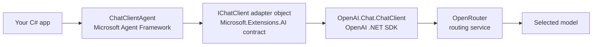
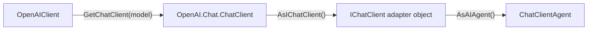
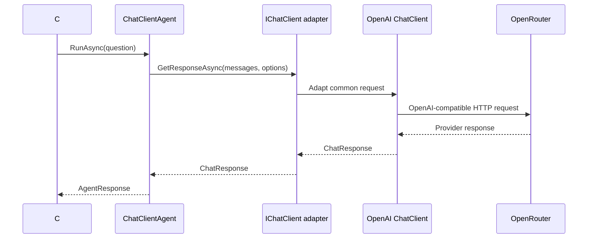

# Video 03 — Where the chat client fits

## The idea in one sentence

`IChatClient` is the boundary between `ChatClientAgent` and the provider-specific SDK that talks to the model service.

## The problem

Our first examples contain several similar names: `OpenAIClient`, `ChatClient`, `IChatClient`, and `ChatClientAgent`. If those names blur together, it is hard to know where configuration belongs or which library you are depending on.

Each layer has one job. This lesson makes the layers separate variables so you can see them.

## Mental model: layers in a request path

Think of a request passing through layers. Each layer has one responsibility and hands the request to the next one.



Requests move right. Responses return left.

Construction happens in the opposite teaching order because each object is adapted for the layer above it:



## The responsibility of each piece

| Piece | Owner | Responsibility |
|---|---|---|
| `AIAgent` / `ChatClientAgent` | Microsoft Agent Framework | Agent behavior and the application-facing run API |
| `IChatClient` | Microsoft.Extensions.AI.Abstractions | Provider-neutral chat operations |
| `AsIChatClient()` | Microsoft.Extensions.AI.OpenAI | Adapts the OpenAI SDK chat client to `IChatClient` |
| `OpenAIClient` | OpenAI .NET SDK | Root client configured with credentials and endpoint |
| `OpenAI.Chat.ChatClient` | OpenAI .NET SDK | Model-specific chat client returned by `GetChatClient(model)` |
| OpenRouter | External service | Receives the compatible HTTP request and routes it to the selected model |

The name `ChatClientAgent` describes an Agent Framework implementation. The name `ChatClient` describes an OpenAI SDK client. They are different types from different libraries.

## Run the example

```powershell
$env:OPENROUTER_API_KEY = "<your-key>"
$env:OPENROUTER_MODEL = "<provider/model>"
dotnet run --project Example/Example.csproj
```

Keep real credentials out of code and recordings.

## Code walkthrough

The complete program is [`Example/Program.cs`](Example/Program.cs).

### 1. Configure the provider SDK

```csharp
OpenAIClient openAIClient = new(
    new ApiKeyCredential(apiKey),
    new OpenAIClientOptions { Endpoint = new Uri("https://openrouter.ai/api/v1") });
```

`OpenAIClient` belongs to the OpenAI .NET SDK. `ApiKeyCredential` holds the credential, while `OpenAIClientOptions.Endpoint` changes the destination from the SDK default to OpenRouter. This object is not an Agent Framework agent.

### 2. Select one model

```csharp
ChatClient sdkChatClient = openAIClient.GetChatClient(model);
```

`OpenAI.Chat.ChatClient` is also an OpenAI SDK type. `OpenAIClient` is the root/factory; it creates this model-specific network client for the model named by `OPENROUTER_MODEL`.

### 3. Adapt it to the common interface

```csharp
IChatClient chatClient = sdkChatClient.AsIChatClient();
```

`IChatClient` comes from Microsoft.Extensions.AI. `AsIChatClient()` is the OpenAI-specific adapter. It lets code above this line use a common chat-client contract instead of the SDK's concrete type.

### 4. Put an agent in front

```csharp
AIAgent agent = chatClient.AsAIAgent(
    instructions: "Answer in one short sentence.",
    name: "LayerExplorer");
```

`AsAIAgent()` is an Agent Framework extension. Source inspection shows that it creates a `ChatClientAgent` around the `IChatClient`. The agent adds agent-level behavior and exposes `RunAsync`.

### 5. Print the layers and run

```csharp
Console.WriteLine($"1. SDK client: {sdkChatClient.GetType().Name}");
Console.WriteLine($"2. Common client: {chatClient.GetType().Name}");
Console.WriteLine($"3. Agent: {agent.GetType().Name}");

AgentResponse response = await agent.RunAsync("Why is a software boundary useful?");
Console.WriteLine($"4. Answer: {response.Text}");
```

`GetType().Name` makes the runtime wrappers visible. Exact adapter type names may change across package versions, so the important result is the order, not memorizing every generated name. `response.Text` prints the completed answer returned through all those layers.

## Complete execution flow



## What happens inside the framework?

`IChatClient.AsAIAgent(...)` constructs a `ChatClientAgent`. When it runs, `ChatClientAgent.RunCoreAsync` prepares messages and chat options, then calls `IChatClient.GetResponseAsync`. It wraps the returned `ChatResponse` in `AgentResponse`.

Agent Framework does not make OpenRouter part of the framework. OpenRouter remains the external destination configured on the SDK client.

## Expected output

```text
1. SDK client: ChatClient
2. Common client: <adapter runtime type>
3. Agent: ChatClientAgent
4. Answer: <one model-generated sentence>
```

## When to use this boundary

Use `IChatClient` when you want provider-neutral chat behavior, client middleware, or an input that `ChatClientAgent` can consume. Keep provider endpoint, credential, and model selection in the SDK construction area.

Do not reach through every abstraction just to access provider-specific features. When code genuinely needs an OpenAI SDK capability, keep that dependency explicit in the provider setup area.

## Recap

- The OpenAI SDK speaks the provider's compatible protocol.
- `AsIChatClient()` adapts the SDK chat client to Microsoft.Extensions.AI.
- `ChatClientAgent` uses that `IChatClient`.
- OpenRouter is an external service, not a framework type.

## Next video

Video 04 keeps these layers unchanged and changes only the agent instructions, so you can see what instructions control.

See [`sources.md`](sources.md) for the verified sources.
