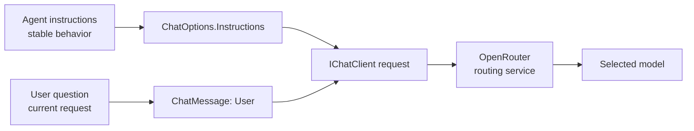
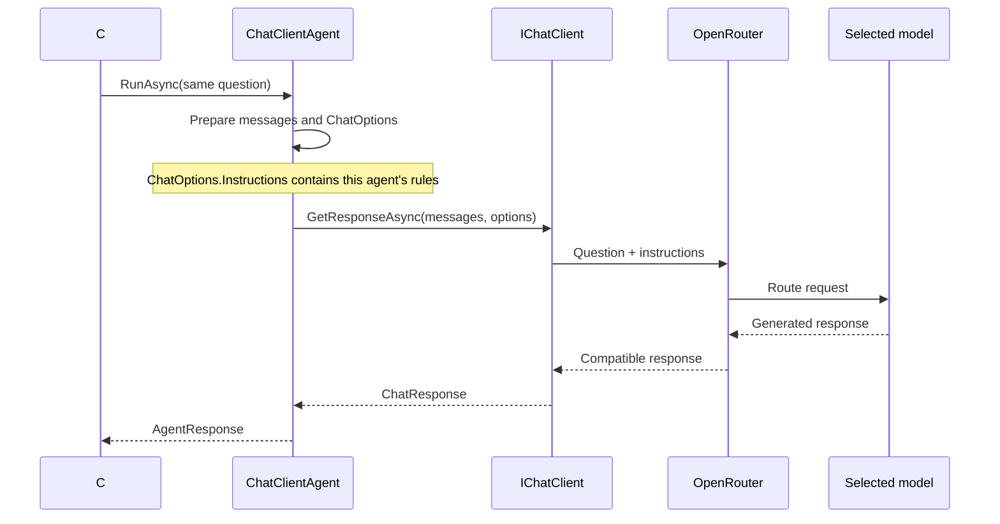

# Video 04 — Give an agent instructions

## The idea in one sentence

Agent instructions describe stable role and response rules that `ChatClientAgent` includes in the effective `ChatOptions` for each run.

## The problem

A user question tells the agent what to do **now**. It should not have to repeat permanent rules such as “teach beginners” or “answer in three steps” on every request.

Instructions keep those stable rules on the agent. The question can remain focused on the current task.

## Mental model: job description and work request

- Instructions are the employee's job description: stable guidance used repeatedly.
- The user message is today's work request: the specific task for this run.



Instructions guide a model; they do not guarantee exact wording or correctness.

## Important types

| Type/member | Owner | Job |
|---|---|---|
| `AIAgent` / `ChatClientAgent` | Microsoft Agent Framework | The agent being configured and run |
| `AsAIAgent(instructions: ...)` | Microsoft Agent Framework | Convenient construction API |
| `ChatClientAgentOptions` | Microsoft Agent Framework | Full configuration object for a chat-client agent |
| `ChatOptions.Instructions` | Microsoft.Extensions.AI | Carries instructions to the chat client |

The simple `instructions:` argument used here is placed into `ChatClientAgentOptions.ChatOptions.Instructions` by the `ChatClientAgent` constructor.

## Run the example

```powershell
$env:OPENROUTER_API_KEY = "<your-key>"
$env:OPENROUTER_MODEL = "<provider/model>"
dotnet run --project Example/Example.csproj
```

The program sends the same question through the same `IChatClient`, but uses two agents with different instructions.

## Code walkthrough

The full example is [`Example/Program.cs`](Example/Program.cs).

### 1. Reuse one chat client

```csharp
IChatClient chatClient = new OpenAIClient(...)
    .GetChatClient(model)
    .AsIChatClient();
```

This is the provider pipeline from Video 03. Keeping it identical helps isolate today's concept: the instruction text.

### 2. Create two roles

```csharp
AIAgent conciseAgent = chatClient.AsAIAgent(
    instructions: "Answer in exactly one short sentence.",
    name: "ConciseTeacher");

AIAgent stepAgent = chatClient.AsAIAgent(
    instructions: "Answer as exactly three short numbered steps for a beginner.",
    name: "StepTeacher");
```

Both agents use the same model path. `ConciseTeacher` asks for one sentence. `StepTeacher` asks for three beginner steps. The names identify the agents; the instructions define the stable response style.

### 3. Keep the user request identical

```csharp
const string Question = "How do I create a new C# console project?";
```

Using the same question makes the effect of the instructions easy to see. In production, results can still vary because model behavior is not deterministic.

### 4. Run each agent

```csharp
Console.WriteLine((await conciseAgent.RunAsync(Question)).Text);
Console.WriteLine((await stepAgent.RunAsync(Question)).Text);
```

`RunAsync` combines the current user request with the agent's configured chat options. Each result is returned as `AgentResponse`; `Text` gives the response text.

## Execution flow



## What happens inside the framework?

The convenient `ChatClientAgent` constructor creates `ChatClientAgentOptions`. When instructions are present, it creates `ChatOptions` and sets `ChatOptions.Instructions`.

During `RunCoreAsync`, the agent prepares the effective chat options and passes them to `IChatClient.GetResponseAsync`. Tests in the repository verify that base instructions reach the client in `ChatOptions.Instructions`.

The instruction is not automatically converted into a user message in this path. It travels as chat options for the provider adapter to represent appropriately.

## Expected output

```text
ConciseTeacher:
Create a console project by running dotnet new console in your chosen folder.

StepTeacher:
1. Open a terminal in your chosen folder.
2. Run dotnet new console.
3. Run dotnet run to test the project.
```

Exact wording may change, and a model may not follow “exactly” perfectly. Compare the intended shape—one sentence versus three numbered steps—rather than expecting identical text.

## When to use instructions

Use instructions for stable role, audience, tone, boundaries, and output rules that should apply to every run of that agent.

Do not put per-request data, secrets, or large changing context into permanent instructions. Instructions are sent to the external model provider; they are not a secret store. Put the current task in the user message. Later videos will show tools and dynamic context.

## Recap

- Instructions are stable agent guidance.
- User messages are current requests.
- `ChatClientAgent` carries instructions in `ChatOptions.Instructions`.
- Instructions influence a model; application code must still validate important output.

## Next video

Video 05 replaces the convenient string prompt with an explicit `ChatMessage` and inspects the returned `AgentResponse`.

See [`sources.md`](sources.md) for verified sources.
