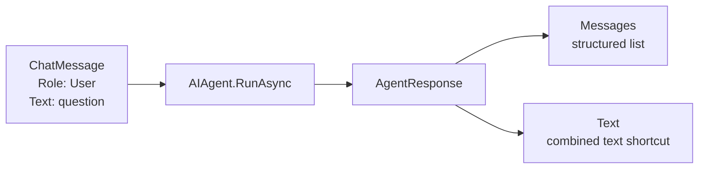
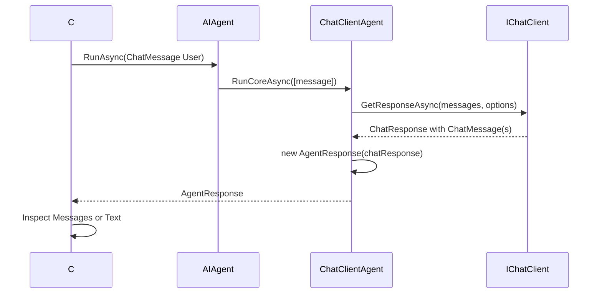

# Video 05 — Send messages and read an agent response

## The idea in one sentence

`ChatMessage` carries input with a role, while `AgentResponse` carries the agent's returned messages and convenient combined text.

## The problem

`RunAsync("hello")` is convenient, but a string hides an important detail: a chat request has an author role. A response can also contain more than one message, so treating it as only one string can hide useful structure.

This lesson makes the input and output objects explicit.

## Mental model: envelope and reply bundle

- `ChatMessage` is an envelope: it contains content and says who sent it.
- `AgentResponse` is a reply bundle: it can contain one or more response messages plus metadata.



## Important types

| Type/member | Owner | Job |
|---|---|---|
| `ChatMessage` | Microsoft.Extensions.AI | Holds a role and content items for one message |
| `ChatRole` | Microsoft.Extensions.AI | Identifies the message author role |
| `AIAgent`, `AgentResponse` | Microsoft Agent Framework | Runs the request and returns agent output |
| `AgentResponse.Messages` | Microsoft Agent Framework | Structured list of returned `ChatMessage` objects |
| `AgentResponse.Text` | Microsoft Agent Framework | Concatenates text content across response messages |

We use only `User` and `Assistant` roles today. Tool and system roles belong to later concepts.

## Run the example

```powershell
$env:OPENROUTER_API_KEY = "<your-key>"
$env:OPENROUTER_MODEL = "<provider/model>"
dotnet run --project Example/Example.csproj
```

## Code walkthrough

The complete program is [`Example/Program.cs`](Example/Program.cs).

Provider-client and agent construction are unchanged from Videos 03–04; the walkthrough begins where today's new message and response types appear.

### 1. Create an explicit user message

```csharp
ChatMessage request = new(ChatRole.User, "What is dependency injection?");
```

`ChatMessage` and `ChatRole` come from Microsoft.Extensions.AI. `ChatRole.User` tells the model-side pipeline that this content came from the user. The text is the current request.

If you call `RunAsync(string)`, Agent Framework creates this same kind of user message for you. The explicit form is useful when you need to see or add message structure.

### 2. Run the agent

```csharp
AgentResponse response = await agent.RunAsync(request);
```

The overload accepts one `ChatMessage`. The base `AIAgent` validates it, wraps it as a collection, and delegates to the concrete agent. The result is Agent Framework's `AgentResponse`.

### 3. Inspect the response structure

```csharp
Console.WriteLine($"Sent role: {request.Role}");
Console.WriteLine($"Returned messages: {response.Messages.Count}");

foreach (ChatMessage message in response.Messages)
{
    Console.WriteLine($"{message.Role}: {message.Text}");
}
```

Most simple model calls return one assistant message, but the response contract allows multiple messages. Iterating `Messages` preserves each role and message boundary.

### 4. Use the text shortcut

```csharp
Console.WriteLine($"Convenient combined text: {response.Text}");
```

`AgentResponse.Text` concatenates text content from all response messages. It is convenient when your application only needs readable text. It ignores non-text content, so use `Messages` and their content items when structure matters.

## Complete execution flow



## What happens inside the framework?

The single-message overload calls the collection overload. `ChatClientAgent.RunCoreAsync` passes prepared messages to `IChatClient.GetResponseAsync`.

The returned Microsoft.Extensions.AI `ChatResponse` already contains `ChatMessage` objects. `AgentResponse(ChatResponse)` preserves its messages and metadata, stores the original response in `RawRepresentation`, and exposes `Text` as a convenience.

Agent Framework does not validate or sanitize message content. Treat user input and model output as untrusted at application boundaries.

## Expected output

```text
Sent role: user
Returned messages: 1
assistant: Dependency injection supplies an object's dependencies from outside instead of creating them internally.
Convenient combined text: Dependency injection supplies an object's dependencies from outside instead of creating them internally.
```

Role capitalization and model wording can vary by library display behavior and model.

## When to use each form

Use `RunAsync(string)` for the smallest text-only call. Use explicit `ChatMessage` when role, author, multiple content items, or message metadata matters.

Use `AgentResponse.Text` for simple display. Inspect `Messages` when you need roles, multiple messages, non-text content, or metadata.

Do not assume every response has exactly one message or contains only text.

## Recap

- A `ChatMessage` has a role and content.
- `ChatRole.User` marks the current request as user-authored.
- `AgentResponse.Messages` preserves structured output.
- `AgentResponse.Text` is a convenient combined-text view.

## Next video

Video 06 changes the return shape from one completed `AgentResponse` to multiple `AgentResponseUpdate` objects that arrive over time.

See [`sources.md`](sources.md) for verified sources.
