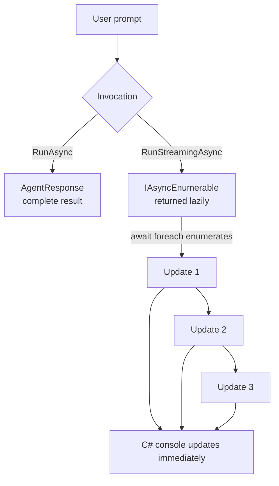
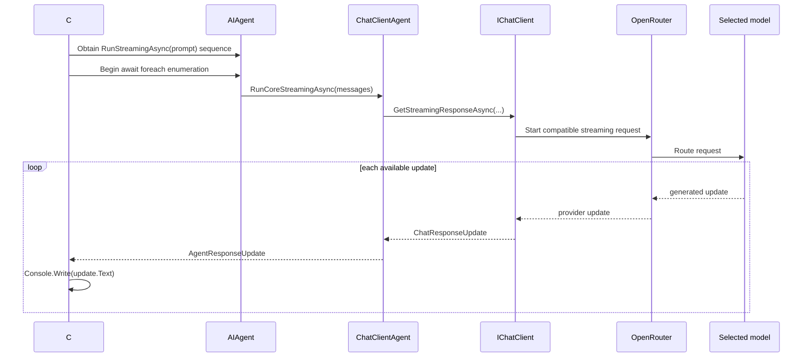

# Video 06 — Stream an agent response

## The idea in one sentence

`RunStreamingAsync` returns `AgentResponseUpdate` objects over time, so the application can display text before the complete answer is ready.

## The problem

`RunAsync` waits until a complete `AgentResponse` is available. That is simple, but a longer answer can leave the user looking at an unchanged screen.

Streaming lets the UI handle each available update immediately. It can improve perceived responsiveness even when total generation time is similar.

## Mental model: package versus conveyor belt

- `RunAsync` gives you one completed package: `Task<AgentResponse>`.
- `RunStreamingAsync` gives you a conveyor belt: `IAsyncEnumerable<AgentResponseUpdate>`.



An update is not guaranteed to be a word, token, sentence, or line. Treat it as the next available piece from the provider pipeline.

## Important types

| Type/member | Owner | Job |
|---|---|---|
| `AIAgent.RunStreamingAsync` | Microsoft Agent Framework | Returns the asynchronous sequence of response updates |
| `IAsyncEnumerable<T>` / `await foreach` | .NET | Asynchronously consumes values as they become available |
| `AgentResponseUpdate` | Microsoft Agent Framework | Represents one streaming response update |
| `AgentResponseUpdate.Text` | Microsoft Agent Framework | Returns the text contained in that update |

## Run the example

```powershell
$env:OPENROUTER_API_KEY = "<your-key>"
$env:OPENROUTER_MODEL = "<provider/model>"
dotnet run --project Example/Example.csproj
```

Streaming support ultimately depends on the configured model/provider path. The program must also keep enumerating until the stream completes.

## Code walkthrough

The complete program is [`Example/Program.cs`](Example/Program.cs).

### 1. Create the same kind of agent

```csharp
AIAgent agent = chatClient.AsAIAgent(
    instructions: "Explain clearly in four short sentences.",
    name: "StreamingTeacher");
```

Nothing special is required during agent construction for this basic case. The change appears at invocation and consumption time.

### 2. Start the output line

```csharp
Console.Write("StreamingTeacher: ");
int updateCount = 0;
```

`Console.Write` avoids a newline so each text update appears on the same line. The counter shows how many `AgentResponseUpdate` objects this run produced.

### 3. Consume the asynchronous stream

```csharp
await foreach (AgentResponseUpdate update in agent.RunStreamingAsync(
    "Why does async/await help a web server?"))
{
    Console.Write(update.Text);
    updateCount++;
}
```

`RunStreamingAsync` returns `IAsyncEnumerable<AgentResponseUpdate>`. That sequence is lazy: merely obtaining it does not start the external request. `await foreach` begins enumeration, and its first `MoveNextAsync` drives the iterator into the provider call. It then waits asynchronously for each next update until the stream completes.

`Console.Write(update.Text)` appends available text immediately. Some updates can carry metadata or non-text content, so `Text` can be empty. The counter includes those empty-text updates too; it is an update count, not a token or text-chunk count. Production code should inspect the fields relevant to its UI.

### 4. Continue only after completion

```csharp
Console.WriteLine($"\n\nUpdates received: {updateCount}");
```

This line runs after enumeration completes. The count is implementation- and provider-dependent; do not test for an exact number.

## Complete execution flow



## What happens inside the framework?

The string overload validates the prompt and creates a user `ChatMessage`. The collection overload delegates to abstract `RunCoreStreamingAsync`.

`ChatClientAgent.RunCoreStreamingAsync` calls `IChatClient.GetStreamingResponseAsync`. For each returned Microsoft.Extensions.AI `ChatResponseUpdate`, it sets agent information and yields a new Agent Framework `AgentResponseUpdate`.

Because execution pauses at each `yield return`, disposing the enumerator matters. `await foreach` handles normal disposal for this example. Later production lessons will add cancellation and error handling.

## Expected output

The answer grows on screen before the count appears:

```text
StreamingTeacher: async/await lets a request pause without blocking its thread...

Updates received: <provider-dependent number>
```

You may receive very small or larger text pieces. Update boundaries are not semantic boundaries.

## When to stream

Stream for chat UIs, terminals, or longer generations where early visible output improves the experience.

Prefer `RunAsync` when the caller must validate or process the complete result before showing anything, or when the provider does not support useful streaming.

Do not concatenate streamed text blindly when you also need tool calls, metadata, or other content types. Handle the update content your application requires.

## Recap

- `RunAsync` returns one completed response.
- `RunStreamingAsync` returns an asynchronous sequence of updates.
- `await foreach` consumes each update without blocking a thread while waiting.
- Update sizes and counts are provider-dependent.

## Next video

Video 07 introduces the difference between the agent definition and an `AgentSession`, which represents one conversation.

See [`sources.md`](sources.md) for verified sources.
