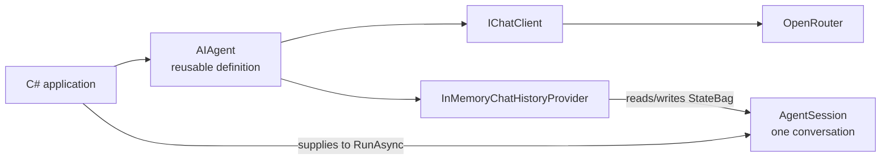

# Why an agent session exists

## One-sentence idea

An `AIAgent` defines how an assistant behaves; an `AgentSession` holds the state for one conversation with that assistant.

## The problem it solves

One agent can serve many conversations. If conversation state lived on the agent itself, details from one user or task could leak into another. A session gives each conversation its own state container while letting the application reuse the same agent definition.

## Mental model

Think of `AIAgent` as a customer-support employee's training and `AgentSession` as one open case file. The employee can handle many cases, but each case needs a separate file.

## Important types and owners

| Type | Owner | Job here |
|---|---|---|
| `AIAgent` | Microsoft Agent Framework | Reusable agent abstraction and behavior |
| `AgentSession` | Microsoft Agent Framework | State for one conversation |
| `ChatClientAgentSession` | Microsoft Agent Framework | Concrete session created by this chat-client agent |
| `ChatHistoryProvider` / `InMemoryChatHistoryProvider` | Microsoft Agent Framework | Agent-configured history mechanism; the default stores history in session state |
| `IChatClient` | Microsoft.Extensions.AI | Provider-neutral chat boundary |
| `OpenAIClient` | OpenAI .NET SDK | Creates an OpenAI-compatible chat client |
| OpenRouter endpoint | External service | Routes the model request |



## Complete execution flow

1. The application creates one OpenRouter-backed `IChatClient`.
2. `AsAIAgent` wraps it in an `AIAgent` with a name and instructions.
3. `CreateSessionAsync` asks that agent to create a compatible local session; for this `ChatClientAgent`, that step does not call the model.
4. `RunAsync` receives both the new user input and that session.
5. The chat-client agent's default `InMemoryChatHistoryProvider` stores the successful turn in that session's `StateBag` for later runs.

## Code walkthrough

The environment variables keep the API key and model choice outside source control:

```csharp
string apiKey = Environment.GetEnvironmentVariable("OPENROUTER_API_KEY")
    ?? throw new InvalidOperationException("OPENROUTER_API_KEY is not set.");
string model = Environment.GetEnvironmentVariable("OPENROUTER_MODEL")
    ?? throw new InvalidOperationException("OPENROUTER_MODEL is not set.");
```

The OpenAI SDK points at OpenRouter's OpenAI-compatible endpoint. `AsIChatClient` adapts the SDK client to the Microsoft.Extensions.AI interface expected by this agent implementation.

```csharp
IChatClient chatClient = new OpenAIClient(
        new ApiKeyCredential(apiKey),
        new OpenAIClientOptions { Endpoint = new Uri("https://openrouter.ai/api/v1") })
    .GetChatClient(model)
    .AsIChatClient();
```

This creates the reusable definition. Its name and instructions are not a conversation transcript.

```csharp
AIAgent agent = chatClient.AsAIAgent(
    instructions: "Answer in one short sentence.",
    name: "TripPlanner");
```

This is the lesson's new line. The agent creates the session because different agent implementations may require different session types or behaviors.

```csharp
AgentSession session = await agent.CreateSessionAsync();
```

The run receives the prompt and the specific conversation to update:

```csharp
Console.WriteLine(await agent.RunAsync(
    "Suggest one activity for a rainy afternoon.", session));
```

## What happens inside the framework

For this `ChatClientAgent`, `CreateSessionAsync` creates a `ChatClientAgentSession`. During a successful run, the agent-configured default `InMemoryChatHistoryProvider` stores the user and assistant messages in that session's `StateBag`. A session may instead carry a service-side conversation identifier, so application code should keep the public `AgentSession` abstraction.

A session is not global memory and is not the agent definition. It is the state boundary for one conversation, and it may not be compatible with another agent.

## Expected output

The exact suggestion varies by model, but the shape is:

```text
Agent: TripPlanner
Session type: ChatClientAgentSession
Visit a local museum for a dry and interesting afternoon.
```

## When to use it

Create a session when a conversation may have follow-up turns, needs per-conversation state, or may later be saved.

## When not to use it

For an intentionally stateless, one-off call, `RunAsync` can be called without explicitly supplying a session. The agent still resolves an internal session for that run, but the caller cannot reuse it for a later turn. Do not share one session across unrelated users or tasks.

## Recap

The agent is the reusable definition. The session is one conversation's state, created by the agent and supplied to a run.

## Next lesson

Session 8 reuses the same session for two related turns so the second prompt can depend on the first.
