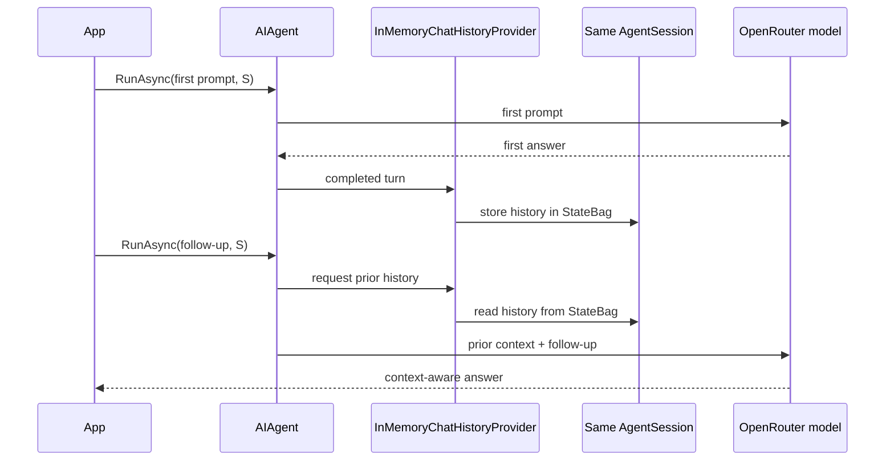

# Continue a conversation with a session

## One-sentence idea

Pass the same `AgentSession` to related runs so the framework can carry conversation context into the follow-up.

## The problem it solves

Follow-up prompts are often incomplete by themselves. “Make the morning activity free” only makes sense after a plan has already been discussed. Manually collecting and resending every earlier message couples application code to transcript management. A session lets the agent's configured history mechanism handle that continuity.

## Mental model

A session is a conversation folder. Each completed turn is added to the same folder, and the next run can open that folder before answering.

## Important types and owners

| Type | Owner | Role |
|---|---|---|
| `AIAgent` | Microsoft Agent Framework | Runs each request |
| `AgentSession` | Microsoft Agent Framework | Identifies and carries one conversation's state |
| `ChatClientAgent` | Microsoft Agent Framework | `AIAgent` implementation created by `AsAIAgent` |
| `ChatHistoryProvider` / `InMemoryChatHistoryProvider` | Microsoft Agent Framework | Agent-configured mechanism that retrieves and stores history; the default uses session state |
| `IChatClient` | Microsoft.Extensions.AI | Sends chat messages to the model transport |
| `OpenAIClient` | OpenAI .NET SDK | Connects to OpenRouter's compatible endpoint |



## Complete execution flow

1. Create the agent and one session.
2. Send the Edinburgh planning request with that session.
3. After the successful call, the agent asks its default history provider to store the user and assistant messages in the session.
4. Send the shorter follow-up with the exact same session instance.
5. Before the second model call, that provider retrieves prior messages from the session and supplies them with the new request.

## Code walkthrough

Configuration and client creation are unchanged from earlier lessons. The agent's instructions keep responses focused:

```csharp
AIAgent agent = chatClient.AsAIAgent(
    instructions: "Help plan short city breaks. Answer briefly.",
    name: "TripPlanner");
```

Only one session is created:

```csharp
AgentSession session = await agent.CreateSessionAsync();
```

The first run establishes the subject:

```csharp
await agent.RunAsync(
    "Plan a Saturday in Edinburgh focused on history.", session);
```

The follow-up does not repeat “Edinburgh,” “Saturday,” or “history.” Passing `session` again is what connects it to the earlier turn:

```csharp
await agent.RunAsync("Make the morning activity free.", session);
```

There is no application-owned `List<ChatMessage>` and no code that concatenates a transcript.

## What happens inside the framework

`ChatClientAgent` resolves the history provider configured on the agent (or overridden for a run). In this setup, the default `InMemoryChatHistoryProvider` reads earlier messages from the session's `StateBag` before the second model call. After a successful call, it stores the new request and response there. A service-managed conversation can use a different storage boundary, but the public pattern is still to reuse the session.

Session continuity does not guarantee a particular answer. The model still generates the response, and long conversations may later require history reduction or another storage strategy.

## Expected output

Wording varies, but the second response should revise the existing Edinburgh plan and make its morning activity free.

```text
You: Plan a Saturday in Edinburgh focused on history.
TripPlanner: Start at Edinburgh Castle ...

You: Make the morning activity free.
TripPlanner: Begin with the free National Museum of Scotland ...
```

## When to use it

Reuse a session for follow-up questions, refinements, corrections, and any sequence that belongs to the same conversation.

## When not to use it

Do not reuse a session for a different user or unrelated task. Do not also rebuild the full transcript manually unless you deliberately configured a history strategy that requires it.

## Recap

Same agent plus same session means the same conversation. With the configured history mechanism managing prior messages, the application sends only the new turn.

## Next lesson

Session 9 creates two sessions from one agent to prove that unrelated conversations remain separate.
