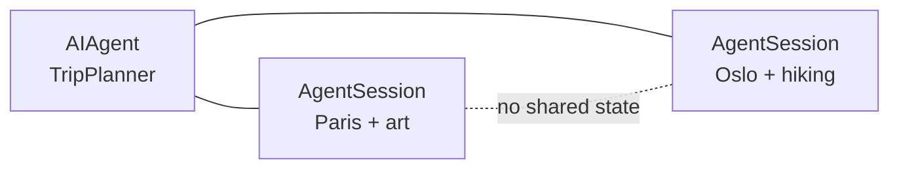

# Start a separate conversation

## One-sentence idea

Create a different `AgentSession` for every unrelated user or task, even when they share the same `AIAgent`.

## The problem it solves

Reusing one session for unrelated requests mixes their conversation histories. A travel agent serving a Paris art trip and an Oslo hiking trip must not answer one user with the other user's details. Separate sessions make that boundary explicit.

## Mental model

The same librarian can manage many borrowers, but each borrower has a different library card. The agent is shared; the conversation record is not.

## Important types and owners

| Type | Owner | Role |
|---|---|---|
| `AIAgent` | Microsoft Agent Framework | One reusable trip-planner definition |
| `AgentSession` | Microsoft Agent Framework | One isolated conversation state container |
| `ChatClientAgent` | Microsoft Agent Framework | Chat-backed agent implementation used by this example |
| `InMemoryChatHistoryProvider` | Microsoft Agent Framework | Default provider that stores each conversation's messages in its session state |
| `IChatClient` | Microsoft.Extensions.AI | Shared model-client abstraction |
| `OpenAIClient` | OpenAI .NET SDK | OpenRouter-compatible transport client |



## Complete execution flow

1. Build one `TripPlanner` agent.
2. Ask it to create `parisSession` and `osloSession`.
3. Complete a Paris-and-art turn in the first conversation; its ignored return value is still recorded after the successful run.
4. Complete an Oslo-and-hiking turn in the second conversation; it is recorded under that other session.
5. Ask the same follow-up through each session.
6. Each answer is based on only that session's prior turn.

## Code walkthrough

The agent is created once. Its instructions and model connection can be reused:

```csharp
AIAgent agent = chatClient.AsAIAgent(
    instructions: "Remember details only within the supplied conversation. Answer briefly.",
    name: "TripPlanner");
```

These two calls create two independent state containers. Descriptive variable names make the application boundary obvious:

```csharp
AgentSession parisSession = await agent.CreateSessionAsync();
AgentSession osloSession = await agent.CreateSessionAsync();
```

Each initial turn is paired with its own session:

```csharp
await agent.RunAsync("My trip is to Paris and I enjoy art.", parisSession);
await agent.RunAsync("My trip is to Oslo and I enjoy hiking.", osloSession);
```

The follow-up text is identical, but the session argument differs:

```csharp
await agent.RunAsync("Which city and interest did I mention?", parisSession);
await agent.RunAsync("Which city and interest did I mention?", osloSession);
```

That second argument is the difference between two safe conversation lanes and one mixed transcript.

## What happens inside the framework

For this chat-client agent, the default in-memory history provider associates messages with each `ChatClientAgentSession`. When the Paris follow-up runs, the framework retrieves the Paris session's history; when the Oslo follow-up runs, it retrieves the Oslo session's history. Both calls still use the same agent definition and `IChatClient`.

Separate session objects are necessary, but a real multi-user application must also map each authenticated user or task to the correct stored session. Never load a caller-provided session identifier without an ownership check.

## Expected output

Exact wording varies, but the facts must remain separated:

```text
Paris session: You mentioned Paris and an interest in art.
Oslo session: You mentioned Oslo and an interest in hiking.
```

## When to use it

Create a new session for a new user, support ticket, document task, planning task, or any conversation that should not inherit earlier context.

## When not to use it

Do not create a new session for a genuine follow-up in the same conversation, because the new session will not contain the earlier context. Do not treat separate sessions as an authorization system; the application still owns access control.

## Recap

One agent can be shared. Unrelated conversations must not share a session. Same conversation means same session; unrelated conversation means new session.

## Next lesson

Session 10 serializes one session, saves it to a file, restores it, and continues after the in-memory object has been replaced.
