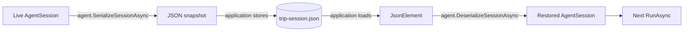

# Save and restore conversation state

## One-sentence idea

Serialize an `AgentSession` to JSON, store it, then deserialize it with a compatible agent implementation and configuration before continuing the conversation.

## The problem it solves

An in-memory session disappears when a console process exits. Web requests may also run on different server instances. To continue later, the application needs a durable representation of the agent's conversation state rather than relying on the original .NET object.

## Mental model

Serialization is a save-game operation. The agent converts its live session into a snapshot; your application stores the snapshot; a compatible agent implementation and configuration loads it before the next turn. It need not be the same .NET object instance.

## Important types and owners

| Type/API | Owner | Role |
|---|---|---|
| `AgentSession` | Microsoft Agent Framework | Live conversation state |
| `AIAgent.SerializeSessionAsync` | Microsoft Agent Framework | Converts the compatible session to `JsonElement` |
| `AIAgent.DeserializeSessionAsync` | Microsoft Agent Framework | Rebuilds a compatible live session |
| `JsonElement` / `JsonDocument` | .NET `System.Text.Json` | JSON snapshot and parsing |
| `File` / `Path` | .NET base class library | Demo storage only |
| `OpenAIClient` | OpenAI .NET SDK | OpenRouter-compatible transport |



## Complete execution flow

1. Create an agent and a new session.
2. Run one turn that establishes Lisbon and a vegetarian preference.
3. Ask the agent to serialize its session to a `JsonElement`.
4. Write the JSON to `trip-session.json` under the built application's output directory.
5. Read and parse the file, then clone the root element so it outlives the `JsonDocument` if needed.
6. Ask the compatible agent in this example to deserialize that JSON into a new live session object.
7. Supply the restored session to a follow-up run.

## Code walkthrough

The familiar setup creates one OpenRouter-backed agent. The first turn writes useful state into its session:

```csharp
AgentSession session = await agent.CreateSessionAsync();
Console.WriteLine(await agent.RunAsync(
    "I am visiting Lisbon and prefer vegetarian food.", session));
```

Serialization belongs to the agent, not to a direct `JsonSerializer.Serialize(session)` call. The agent knows its supported concrete session shape and attached behaviors.

```csharp
JsonElement savedState = await agent.SerializeSessionAsync(session);
```

The application owns storage. This sample uses a local file only to make the boundary visible:

```csharp
string stateFile = Path.Combine(AppContext.BaseDirectory, "trip-session.json");
await File.WriteAllTextAsync(stateFile, savedState.GetRawText());
```

Loading reverses those responsibilities. .NET reads and parses the bytes; the agent reconstructs the session:

```csharp
using JsonDocument document = JsonDocument.Parse(
    await File.ReadAllTextAsync(stateFile));
AgentSession restoredSession = await agent.DeserializeSessionAsync(
    document.RootElement.Clone());
```

`Clone` creates an independent `JsonElement`, avoiding a lifetime dependency on the disposable `JsonDocument`.

The follow-up uses `restoredSession`, not the original `session`:

```csharp
Console.WriteLine(await agent.RunAsync(
    "Which city and food preference did I mention?", restoredSession));
```

## What happens inside the framework

`AIAgent` delegates serialization and deserialization to its implementation. On serialization, `ChatClientAgent` checks that the supplied object is a `ChatClientAgentSession`. On deserialization, `ChatClientAgentSession` validates the expected JSON shape and reconstructs that concrete type; this does not prove semantic compatibility with arbitrary instructions, providers, or configuration. Its snapshot can contain a conversation ID plus provider-specific state in the session `StateBag`.

This program proves that JSON can rebuild a new session object and continue within one process. Those stored bytes are also the boundary needed across a restart, although the demo does not restart itself.

Serialization does not choose a database, filename, retention policy, encryption method, user mapping, or concurrency strategy. Those remain application responsibilities.

## Security boundary

Treat session JSON as sensitive. It may contain user conversation content, identifiers, and personally identifiable information. Store it with appropriate access controls and encryption at rest. Loading modified or untrusted session JSON is equivalent to accepting untrusted input: altered roles or injected content could influence later model behavior. Authorize the user/session association before loading it.

## Expected output

The first and last model sentences vary. The final answer should recall the saved facts:

```text
Understood—you are visiting Lisbon and prefer vegetarian food.
Saved session to ...\trip-session.json
You mentioned Lisbon and a preference for vegetarian food.
```

The generated `trip-session.json` appears beside the built executable.

## When to use it

Use serialization when a conversation must survive application restarts, move between service requests or instances, or be stored outside process memory.

## When not to use it

Do not persist sessions that are intentionally one-off. Do not expose raw snapshots to clients or use an unprotected local file as a production store. A different agent instance may restore a snapshot when its implementation and configuration are compatible, but do not assume compatibility across arbitrary agents.

## Recap

The agent owns conversion between live session and JSON. The application owns secure durable storage and the mapping from a user or task to the correct snapshot.

## Next lesson

Session 11 begins the tools section by giving an agent one small C# function it can choose to call.
