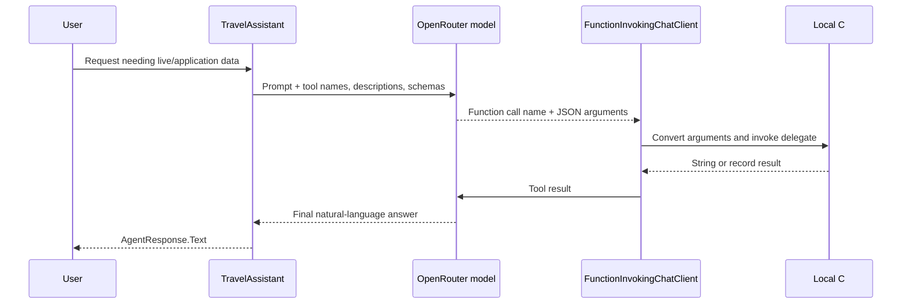

# Function tools in Microsoft Agent Framework: the complete flow

## One-sentence idea

Function tools let a model request ordinary C# code, receive its result, and use that result in a final answer; the same mechanism can expose several functions or even another agent.

## The problem tools solve

A model generates text from the context it receives. It cannot read your live database, apply your application's exchange rate, or call a specialist merely because you mention those capabilities in its instructions.

A function tool creates an explicit boundary between model reasoning and application code:

1. C# describes an available operation.
2. The model decides whether to request it and supplies arguments.
3. The local .NET process runs the operation.
4. Its result returns to the model as tool content.
5. The model writes a user-facing answer grounded in that result.

This lesson puts the whole tool path in one program: one function, typed parameters, returned results, selection between tools, an explicit failure result, and one agent exposed as a tool.

## Mental model

Treat the model as a coordinator at a service desk. It can read a catalogue of operations and fill in a request form, but it does not execute your C# code itself. `FunctionInvokingChatClient` receives the form, calls the matching local delegate, and puts the result back on the desk. The model then explains the result.

## Important types and owners

| Type | Owner | Job in this lesson |
|---|---|---|
| `AIAgent` / `ChatClientAgent` | Microsoft Agent Framework | Runs the main and specialist agents |
| `AgentSession` / `AgentResponse` | Microsoft Agent Framework | Holds one demonstration's conversation state / returns its completed response |
| `AIAgentExtensions.AsAIFunction` | Microsoft Agent Framework | Wraps an agent as an invocable function tool |
| `AIFunctionFactory` | Microsoft.Extensions.AI | Creates an `AIFunction` from a .NET delegate and derives JSON schemas |
| `AIFunction` / `AITool` | Microsoft.Extensions.AI | Tool metadata plus, for `AIFunction`, executable behavior |
| `FunctionInvokingChatClient` | Microsoft.Extensions.AI | Runs requested local functions and continues the model/tool loop |
| `[Description]` | .NET `System.ComponentModel` | Adds tool and parameter guidance for the model |
| `IChatClient` | Microsoft.Extensions.AI | Provider-neutral chat client boundary |
| `OpenAIClient` | OpenAI .NET SDK | Connects to OpenRouter's OpenAI-compatible endpoint |
| OpenRouter | External service | Routes model requests; it does not execute the local C# methods |

## The complete tool loop



The model requests a call. The .NET process executes it. That security boundary matters: descriptions guide model selection, but C# validation and authorization must still protect the real operation.

## Example structure

The program has nine labeled code sections and five visible runs:

| Run | What it demonstrates |
|---|---|
| One tool | Register and execute `GetWeather` |
| Parameters and result | Map model arguments to `decimal` and `string` parameters, then return a record |
| Tool choice | Select fixed demonstration weather instead of the other registered tools |
| Expected tool-domain failure | Return `Success=false` and an honest reason for an unsupported route |
| Agent as a tool | Delegate packing advice to `PackingSpecialist` |

## Code walkthrough

### 1. Configure the shared model client

The API key and model remain in environment variables. `OpenAIClient` belongs to the OpenAI .NET SDK, while `AsIChatClient` adapts its chat client to Microsoft.Extensions.AI:

```csharp
IChatClient chatClient = new OpenAIClient(
        new ApiKeyCredential(apiKey),
        new OpenAIClientOptions { Endpoint = new Uri("https://openrouter.ai/api/v1") })
    .GetChatClient(model)
    .AsIChatClient();
```

The main and specialist agents share this transport. Sharing a client does not merge their instructions or sessions.

### 2. Turn C# methods into tools

`AIFunctionFactory.Create` receives each method as a delegate:

```csharp
AIFunction weatherTool = AIFunctionFactory.Create(GetWeather);
AIFunction currencyTool = AIFunctionFactory.Create(ConvertCurrency);
AIFunction travelTimeTool = AIFunctionFactory.Create(GetTravelTime);
```

Microsoft.Extensions.AI reflects over the method signature. It derives a JSON input schema from parameters and, by default, a result schema from the return type. The resulting `AIFunction` contains both metadata for the model and the delegate that local code can invoke.

### 3. Describe a tool and its parameters

The `Description` attributes are not C# comments. They become metadata that the model can see:

```csharp
[Description("Converts an amount between supported currencies using fixed demonstration rates.")]
static CurrencyResult ConvertCurrency(
    [Description("The amount to convert.")] decimal amount,
    [Description("Three-letter source currency code, such as GBP.")] string fromCurrency,
    [Description("Three-letter target currency code, such as EUR.")] string toCurrency)
```

The model might request arguments resembling:

```json
{
  "amount": 125,
  "fromCurrency": "GBP",
  "toCurrency": "EUR"
}
```

The function-invocation layer deserializes those values into the method's typed parameters. The console line inside `ConvertCurrency` makes the actual received values visible during the demo.

Parameter schemas improve the model's request, but the method must still validate values. Model-produced arguments are untrusted input.

### 4. Return a tool result

The currency method returns a record rather than user-facing prose:

```csharp
sealed record CurrencyResult(
    bool Success,
    decimal? ConvertedAmount,
    string Message);
```

Microsoft.Extensions.AI serializes this result into tool content. The result goes back to the model, not directly to the console as the agent's answer. The model reads it and produces `AgentResponse.Text`.

This separation lets C# own facts and calculations while the model owns the conversational explanation.

### 5. Register several tools

The main agent receives all four tools in one collection:

```csharp
AIAgent travelAgent = chatClient.AsAIAgent(
    instructions: "Use the available tools when a request needs their data...",
    name: "TravelAssistant",
    tools: [weatherTool, currencyTool, travelTimeTool, packingSpecialistTool]);
```

Tool registration makes operations available; it does not force every operation to run. For “the fixed demonstration weather for Lisbon,” the model is expected to choose `GetWeather` because its name, description, and schema fit the request better than currency conversion or travel time. The returned values are deliberately fixed so the example stays deterministic; they are not a live weather feed.

Tool selection is model-generated and therefore not a permission boundary. Only register tools the current caller may use, and enforce authorization inside sensitive operations.

### 6. Understand the automatic loop

Calling the agent still looks familiar:

```csharp
AgentResponse response = await travelAgent.RunAsync(prompt, session);
```

For a tool request, one `RunAsync` can cause more than one model call:

1. The first model response asks for a tool.
2. `FunctionInvokingChatClient` invokes the matching `AIFunction`.
3. It adds the tool result to the conversation sent to the model.
4. A later model response contains the final answer.

The framework-created chat-client pipeline performs this loop. Application code does not manually parse function-call JSON or submit the result in another `RunAsync` call.

### 7. Make an expected tool-domain failure visible

The travel-time tool represents an unsupported route as data:

```csharp
return new TravelTimeResult(
    false,
    null,
    $"No supported route from {origin} to {destination}.");
```

The `Success=false` field prevents a missing value from looking like a valid estimate, and `Message` preserves the cause. The main agent is instructed to explain that failure clearly.

This is an expected domain failure, not an unexpected exception. Real tools should still log unexpected exceptions and use the application's error policy. Do not leak stack traces, credentials, connection strings, or private implementation details into tool results.

### 8. Expose an agent as a tool

The specialist has narrow instructions, a name, and a description:

```csharp
AIAgent packingSpecialist = chatClient.AsAIAgent(
    instructions: "Recommend exactly three practical packing items. Be concise.",
    name: "PackingSpecialist",
    description: "Creates a short packing list for a destination and weather.");

AIFunction packingSpecialistTool = packingSpecialist.AsAIFunction();
```

`AsAIFunction()` creates a function that accepts a `query` string, calls the inner agent, and returns its response text. The outer `TravelAssistant` sees it like any other tool.

Because no specialist session is supplied to `AsAIFunction`, the extension creates a new inner session for each invocation. The outer conversation is not automatically copied into the specialist; the outer model must put the relevant destination and weather into the tool query.

Use an agent as a tool when the inner role genuinely needs its own instructions, tools, or expertise. A deterministic calculation such as currency conversion should remain an ordinary C# function.

Delegation also adds at least one inner-agent model run, so it usually costs more time and tokens than a deterministic local function.

### 9. Keep the demo observable

Every ordinary local C# function writes a line such as:

```text
[tool] ConvertCurrency received amount=125, from='GBP', to='EUR'
```

That line proves local C# ran and shows the arguments that reached it. The following `TravelAssistant:` line is the model's final response after receiving the tool result. `AsAIFunction()` exposes the specialist's returned text to the outer loop, so this small example does not print an equivalent inner-agent trace.

`AskAsync` creates a fresh outer `AgentSession` for each demonstration. That prevents the earlier weather or currency runs from influencing a later tool-selection example.

## What happens inside the framework

`AsAIAgent` creates a `ChatClientAgent`. Its configured tools are placed in chat options, and the Agent Framework chat-client pipeline ensures a `FunctionInvokingChatClient` is present. The model receives tool declarations with names, descriptions, and schemas. When it returns function-call content, `FunctionInvokingChatClient` finds an invocable `AIFunction`, binds arguments, calls it, adds the result to the chat, and continues until it receives a normal model response or reaches its loop policy.

For `packingSpecialist.AsAIFunction()`, Microsoft Agent Framework supplies the delegate that invokes the inner `AIAgent`. From the outer loop's perspective, its returned string is simply another function result.

## Expected output

Model prose varies, but the local tool lines and facts should resemble:

```text
=== 1. ONE TOOL ===
You: Use the weather tool to tell me the weather in Edinburgh.
[tool] GetWeather received city='Edinburgh'
TravelAssistant: Edinburgh has light rain and a temperature of 12°C.

=== 2. PARAMETERS AND RESULT ===
[tool] ConvertCurrency received amount=125, from='GBP', to='EUR'
TravelAssistant: 125 GBP converts to 146.25 EUR using the demonstration rate.

=== 3. TOOL CHOICE ===
[tool] GetWeather received city='Lisbon'
TravelAssistant: Lisbon is sunny at 24°C.

=== 4. EXPECTED TOOL-DOMAIN FAILURE ===
[tool] GetTravelTime received origin='Atlantis', destination='Paris'
TravelAssistant: The route is unsupported, so no travel-time estimate is available.

=== 5. AGENT AS A TOOL ===
TravelAssistant: Pack a waterproof jacket, compact umbrella, and water-resistant shoes.
```

Tool choice and wording remain model-dependent. If the selected OpenRouter model does not support function calling reliably, choose a model that does.

## When to use tools

Use function tools for live data, deterministic calculations, application actions, database/API boundaries, and narrow specialists the model should call only when relevant.

## When not to use tools

Do not create a tool for static guidance that belongs in instructions. Do not use an inner agent for deterministic code. Do not expose privileged methods without authorization, validation, timeouts, cancellation, audit logging, and appropriate approval controls.

## Recap

- `AIFunctionFactory.Create` turns a .NET method into a model-visible, locally invocable tool.
- Method signatures and descriptions create the argument schema.
- The model selects a tool and proposes arguments; C# validates and executes them.
- Tool results return to the model before the final answer.
- Expected failures should be explicit and safe.
- `AsAIFunction()` lets an outer agent delegate to a focused inner agent.

## Next lesson

Session 12 begins structured responses: why applications sometimes need typed data instead of free-form assistant text.
