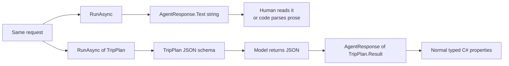

# Session 12 — From free-form text to one typed C# result

## The idea in one sentence

Use `RunAsync<T>` when your .NET program needs model output in a known C# shape instead of prose whose layout may change.

## The problem it solves

An agent can answer with useful prose, but prose is a poor application contract. A model may rename a heading, reorder a list, add an introduction, or format a number differently on the next run. Code that searches that text for “Budget:” is therefore coupled to presentation rather than meaning.

Structured output lets the application state the fields and types it needs. In this lesson, the same city-break request is made twice:

1. `RunAsync(...)` returns free-form text for a person to read.
2. `RunAsync<TripPlan>(...)` requests JSON matching `TripPlan`, and `.Result` gives the program a typed object.

This is still model output, not a guarantee that every business rule is correct. The program must validate important values after deserialization.

## Mental model: a form instead of a blank page

Free-form output is like asking someone to answer on a blank page. The answer may be clear, but your program must guess where each fact is.

A structured response is like supplying a form with labeled boxes: destination, days, budget, and activities. The model fills the boxes, and C# receives an object with matching properties.

## Important types and who owns them

| Type | Owner | Job in this lesson |
|---|---|---|
| `AIAgent` | Microsoft Agent Framework | Accepts the request and runs the agent. |
| `AgentResponse` | Microsoft Agent Framework | Represents the ordinary free-form response. Its `Text` is a string. |
| `AgentResponse<TripPlan>` | Microsoft Agent Framework | Holds response text that is expected to deserialize as `TripPlan`. |
| `RunAsync<T>` | Microsoft Agent Framework | Requests a response format derived from `T`. |
| `ChatResponseFormat` | Microsoft.Extensions.AI | Represents the JSON-schema response format sent through the chat abstraction. |
| `TripPlan` | This example | The application-owned C# contract. |
| `IChatClient` | Microsoft.Extensions.AI | Provider-neutral chat-client abstraction used by the agent. |
| `OpenAIClient` | OpenAI .NET SDK | Connects that abstraction to OpenRouter's OpenAI-compatible endpoint. |
| `ApiKeyCredential` | System.ClientModel | Carries the environment-supplied credential into the SDK client. |
| OpenRouter | External service | Routes the request to the configured model; the selected model must support structured output. |

## Free-form versus typed flow



The important boundary is after the response. Free-form text leaves the application with one string. The typed path gives it `Destination`, `Days`, `EstimatedDailyBudgetGbp`, and `Activities`.

## Complete execution flow

1. The program reads the OpenRouter key and model name from environment variables.
2. `OpenAIClient` targets OpenRouter, and `AsIChatClient()` exposes the Microsoft.Extensions.AI abstraction.
3. `AsAIAgent()` creates the Microsoft Agent Framework agent.
4. The first `RunAsync(Request)` asks for an ordinary response. The application receives `AgentResponse.Text`.
5. The second call supplies `TripPlan` as the generic type: `RunAsync<TripPlan>(Request)`.
6. Agent Framework derives a JSON response format from `TripPlan` and passes it through the chat-client request.
7. A structured-output-capable model returns JSON in that requested shape.
8. Accessing `typedResponse.Result` deserializes the response text into `TripPlan` with `System.Text.Json`.
9. The program reads properties, compares the decimal budget, counts activities, and loops over the list without parsing prose.

## Code walkthrough

The complete runnable code is in [`Example/Program.cs`](Example/Program.cs). Its section comments are also the recommended order for reading and recording it.

### 1. Create the same agent used by both paths

```csharp
IChatClient chatClient = new OpenAIClient(
        new ApiKeyCredential(apiKey),
        new OpenAIClientOptions { Endpoint = new Uri("https://openrouter.ai/api/v1") })
    .GetChatClient(model)
    .AsIChatClient();

AIAgent agent = chatClient.AsAIAgent(
    instructions: "Create concise city-break plans from the user's requirements.",
    name: "CityPlanner");
```

`OpenAIClient` supplies the provider connection. `IChatClient` is the Microsoft.Extensions.AI boundary. `AIAgent` is the framework object the application runs. Both response styles use this same agent so the comparison changes only the response contract.

`ApiKeyCredential` belongs to System.ClientModel. It wraps the key read from `OPENROUTER_API_KEY`; no key is stored in source code.

### 2. See what the free-form call gives the program

```csharp
AgentResponse freeFormResponse = await agent.RunAsync(Request);

Console.WriteLine(freeFormResponse.Text);
Console.WriteLine($"Application received a {freeFormResponse.Text.GetType().Name}.");
```

The response may look well organized, but the program sees a `String`. It has no reliable `Days` or `Activities` property. Manual parsing would depend on headings and punctuation chosen by the model.

### 3. Define the application contract

```csharp
sealed class TripPlan
{
    public required string Destination { get; init; }
    public required int Days { get; init; }
    public required decimal EstimatedDailyBudgetGbp { get; init; }
    public required List<string> Activities { get; init; }
}
```

`TripPlan` is ordinary application code, not a framework base class. Its descriptive property names and types define the data shape. `EstimatedDailyBudgetGbp`, for example, makes both the meaning and currency explicit without introducing another framework feature.

`required` helps the C# compiler when your code constructs a `TripPlan`, and System.Text.Json treats required members as properties that must be present during deserialization. That is only presence validation. It does not prove a string is non-empty, a budget is sensible, or a claim is true. Likewise, `List<string>` defines a list of strings, but this class alone does not enforce exactly three items. The prompt requests three; application code should validate that count if the rule matters.

### 4. Request and retrieve one typed result

```csharp
AgentResponse<TripPlan> typedResponse =
    await agent.RunAsync<TripPlan>(Request);

TripPlan plan = typedResponse.Result;
```

The type argument is the central change. It tells Agent Framework which response shape to request. The generic response exposes concatenated response text through `Text`; its `Result` property deserializes that text into `TripPlan`.

This does not turn a probabilistic model into a database. Structured-output support depends on the selected OpenRouter model, and malformed or incompatible output can still fail. Session 13 handles that failure path.

### 5. Use the values as normal C#

```csharp
Console.WriteLine($"Destination: {plan.Destination}");
Console.WriteLine($"Activity count: {plan.Activities.Count}");

string budgetCategory = plan.EstimatedDailyBudgetGbp <= 150m
    ? "Within the demo's budget threshold"
    : "Above the demo's budget threshold";
```

The application now uses a `string`, an `int`, a `decimal`, and a `List<string>`. There is no regular expression, heading detection, or manual `JsonSerializer.Deserialize` call in application code.

## What happens inside Agent Framework

The generic `RunAsync<T>` helper creates a JSON-schema response format for `T`, copies or creates the run options, assigns that response format, and then uses the ordinary agent run path. The returned response is wrapped as `AgentResponse<T>`.

When application code accesses `.Result`, the framework reads the response `Text` and deserializes the first top-level JSON object with `System.Text.Json`. Empty, malformed, incompatible, or null output can therefore produce an exception. That behavior is deliberately visible rather than silently inventing a `TripPlan`.

## Expected output

The wording and values come from the selected model, so they will vary. The shape should resemble:

```text
=== FREE-FORM RESPONSE ===
Day 1: Visit the Brandenburg Gate ...
Application received a String.

=== STRUCTURED JSON ===
{"destination":"Berlin","days":2,"estimatedDailyBudgetGbp":120,"activities":[...]}

=== TYPED C# VALUES ===
Destination: Berlin
Days: 2
Daily budget: £120.00
Activity count: 3
Budget check: Within the demo's budget threshold
1. Visit the Brandenburg Gate
2. Explore Museum Island
3. Walk along the East Side Gallery
```

The sample shows three activities because the request asks for three. `List<string>` does not itself enforce that count.

Run it with:

```powershell
$env:OPENROUTER_API_KEY = "your-key"
$env:OPENROUTER_MODEL = "a-model-with-structured-output-support"
dotnet run --project lessons/12-typed-structured-response/Example
```

## When to use it

Use a typed response when the result feeds application logic, UI fields, storage, another API, filtering, sorting, or calculations. Keep the contract small and describe fields whose meaning is not obvious from their names.

## When not to use it

Do not add a schema when the response is only prose for a person, such as an explanation or draft email. Do not treat structured output as business validation, factual verification, or authorization. Those remain application responsibilities.

## Recap

- Free-form `RunAsync` gives application code a string.
- `RunAsync<TripPlan>` requests a JSON shape based on an ordinary C# type.
- `AgentResponse<TripPlan>.Result` deserializes the response into typed data.
- Typed data removes brittle prose parsing, but important values still need validation.

## Next lesson

Session 13 keeps this same typed-response idea and handles the case where the returned data cannot be deserialized or accepted safely.
