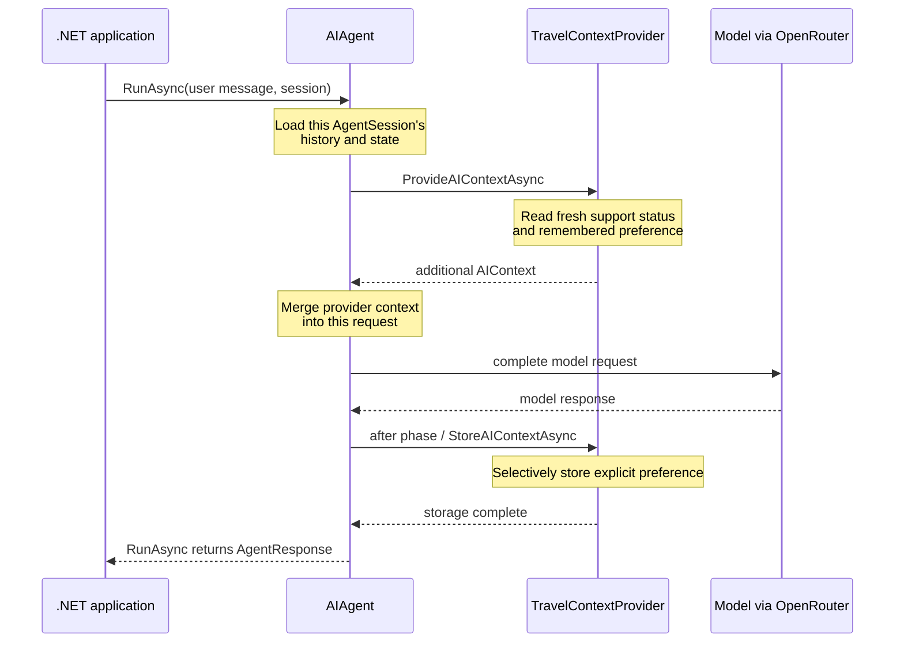

# Session 14 — Context and memory in one C# example

## The idea in one sentence

An `AIContextProvider` runs around every agent request so application code can supply fresh information before the model call and selectively store useful state after it.

## The problem it solves

An agent does not automatically know that support hours changed, which travel option a user prefers, or which facts should survive beyond one conversation. Putting every fact permanently into the agent instructions makes them stale. Asking the model to call a tool is also different: the model may decide not to call it.

A context provider is developer-controlled. Register it once, and the framework invokes it around each run. It can:

- retrieve current application context before the model runs;
- add that context to the request;
- inspect a successful interaction afterward;
- store a small, selected memory for a later run.

This lesson demonstrates all four actions with one `TravelContextProvider`.

## Mental model: prepare, run, learn

Think of the provider as an assistant standing beside the model request:

1. **Prepare:** before the request, place current support status and any remembered preference into the working context.
2. **Run:** the model answers using the assembled context.
3. **Learn:** after a successful request, copy one explicitly marked preference into application-owned state.

The provider does not make the model larger or retrain it. It changes what information is available for this run.

## Important types and ownership

| Type | Owner | Job in this lesson |
|---|---|---|
| `AIAgent` and `AgentSession` | Microsoft Agent Framework | Run the assistant and identify separate conversations. |
| `ChatClientAgentOptions` | Microsoft Agent Framework | Registers `AIContextProviders` and the base chat options. |
| `AIContextProvider` | Microsoft Agent Framework | Defines the before/after context-provider lifecycle. |
| `AIContext` | Microsoft.Extensions.AI | Carries extra instructions, messages, or tools to merge into a request. |
| `ProviderSessionState<T>` | Microsoft Agent Framework | Saves provider-owned state under a key in an `AgentSession`. |
| `ChatMessage`, `ChatRole`, `IChatClient` | Microsoft.Extensions.AI | Represent messages, roles, and the provider-neutral model client. |
| `TravelContextProvider`, `TravelProfile` | This example | Retrieve live status and store one selected preference. |
| `OpenAIClient` | OpenAI .NET SDK | Connects to OpenRouter's OpenAI-compatible endpoint. |
| `ApiKeyCredential` | System.ClientModel | Wraps the key read from the environment. |
| OpenRouter | External service | Routes each model request to `OPENROUTER_MODEL`. |

## Request lifecycle



The before phase affects the current model request. The after phase prepares state for a future request.

## Conversation history is not memory

These terms are related but not interchangeable.

| Conversation history | Memory in this example |
|---|---|
| Ordered messages from one `AgentSession` | One selected fact: preferred transport |
| Preserves what was said in that conversation | Preserves what the application decided was useful |
| A new session starts a new history | Memory can be deliberately loaded or copied into another session |
| Can grow with every turn | Should remain focused and scoped |

When created, `conversationB` cannot see `conversationA`'s transcript and initially has neither that history nor the saved preference. After its first run, conversation B naturally has its own first question and answer, but it still has none of conversation A's transcript. The application then copies a new `TravelProfile` containing only the selected value into `conversationB`, proving that memory can move without replaying the old transcript.

This tutorial stores the preference in session state to keep the mechanism visible. A real cross-session memory system would normally load a user-scoped profile from durable storage instead of manually copying it.

## Complete execution flow

1. The program creates an OpenRouter-backed `IChatClient`.
2. It constructs `TravelContextProvider` with a delegate that reads the current support status.
3. `ChatClientAgentOptions.AIContextProviders` attaches that provider to the agent.
4. Conversation A asks the application to remember `transport=train`.
5. Before the model call, `ProvideAIContextAsync` supplies the current support status and reports that no preference exists yet.
6. After the successful call, `StoreAIContextAsync` recognizes the explicit `Remember preference:` syntax and stores `train` in `ProviderSessionState<TravelProfile>`.
7. The application changes `supportStatus`. The next run receives the new status because the provider reads it again.
8. Conversation B starts as a separate `AgentSession`, with new chat history and new provider state.
9. Its first run receives neither conversation A's transcript nor its preference; afterward, B has only its own first exchange.
10. The application creates a new `TravelProfile` containing the saved value in conversation B.
11. The next run recalls `train` without receiving conversation A's transcript.

## Code walkthrough

The complete example is in [`Example/Program.cs`](Example/Program.cs). Its numbered section comments are the recording path.

### 1. Represent dynamic application state

```csharp
string supportStatus = "Travel support is open until 17:00 UTC.";

TravelContextProvider contextProvider = new(
    getSupportStatus: () => supportStatus);
```

The string stands in for live application state. The delegate reads its current value rather than capturing a one-time copy. In a production system, that delegate could call a trusted database or service.

### 2. Register the provider once

```csharp
AIAgent agent = chatClient.AsAIAgent(new ChatClientAgentOptions
{
    Name = "TravelAssistant",
    ChatOptions = new ChatOptions
    {
        Instructions = "You are a concise travel assistant..."
    },
    AIContextProviders = [contextProvider]
});
```

`AIContextProviders` is the registration point. Application code does not manually call the provider around every `RunAsync`; the agent pipeline does that.

### 3. Store a deliberately marked preference

```csharp
AgentResponse saveResponse = await agent.RunAsync(
    "Remember preference: transport=train. Confirm briefly.",
    conversationA);
```

The syntax is intentionally strict. This lesson does not add a second model call to extract arbitrary facts. After a successful run, the provider recognizes the prefix, normalizes the value to lowercase, and accepts only `train`, `plane`, or `car`. That makes storage deterministic and keeps the lesson about lifecycle rather than extraction quality.

### 4. Retrieve fresh context before each run

```csharp
protected override ValueTask<AIContext> ProvideAIContextAsync(
    InvokingContext context,
    CancellationToken cancellationToken = default)
{
    TravelProfile profile = _profiles.GetOrInitializeState(context.Session);

    return new ValueTask<AIContext>(new AIContext
    {
        Instructions = $"Trusted application context: ..."
    });
}
```

This is the before hook. `context.Session` identifies the current conversation. The provider loads that session's `TravelProfile`, reads the latest support status, and returns additional instructions. Agent Framework merges those instructions into the context sent to the model.

The word “trusted” is a statement made by this demonstration application, not a validation performed by the framework. Context retrieved from users, documents, or external services must be authorized, validated, and protected against indirect prompt injection before injection.

### 5. Store selected state after success

```csharp
protected override ValueTask StoreAIContextAsync(
    InvokedContext context,
    CancellationToken cancellationToken = default)
{
    foreach (ChatMessage message in
        context.RequestMessages.Where(m => m.Role == ChatRole.User))
    {
        // Parse the explicit demo prefix, validate the allow-list,
        // then call _profiles.SaveState(...).
    }

    return ValueTask.CompletedTask;
}
```

This is the after hook. The `AIContextProvider` base implementation calls it only for a successful invocation and applies its configured message filters first. The example examines external user messages and stores one allow-listed value. It does not save model prose as trusted memory.

### 6. Keep provider state in the session

```csharp
_profiles = new ProviderSessionState<TravelProfile>(
    _ => new TravelProfile(),
    stateKey: nameof(TravelContextProvider));

public override IReadOnlyList<string> StateKeys => [_profiles.StateKey];
```

`ProviderSessionState<T>` reads and writes the provider's value through the session state bag using its `StateKey`. The provider exposes that same key through `StateKeys` so the framework can validate provider key conflicts and handle provider-owned session state. A new session receives a new default `TravelProfile` unless the application loads another profile value.

The lifecycle API declares `context.Session` as nullable because context providers can be used through different agent paths. Every run in this example explicitly supplies a created `AgentSession`, and the chat-client agent invokes this provider with that session. At the helper level, `GetOrInitializeState(null)` returns an unpersisted default and `SaveState(null, ...)` does nothing; provider authors should choose an intentional stateless behavior or require a session for stateful scenarios.

### 7. Move memory without moving history

```csharp
AgentSession conversationB = await agent.CreateSessionAsync();

contextProvider.SetProfile(conversationB, savedProfile);
```

At creation, the new session has blank conversation history. By the time `SetProfile` runs, conversation B contains its own first question and answer, but none of conversation A's messages. `SetProfile` creates a new `TravelProfile` containing only the selected preference. In a production application, this is where a stable, authenticated user ID would be used to load the correct durable profile.

## What happens inside the framework

For a chat-client agent, the request pipeline loads chat history, then calls registered context providers in order. Each provider can contribute instructions, messages, and tools. The framework merges those contributions into the request before invoking the model.

After the run, providers receive the accumulated request messages, response messages, session, and failure information. The default `AIContextProvider` behavior skips `StoreAIContextAsync` when invocation failed. Provider code can therefore separate retrieval from successful storage while using the same component.

Every injected token consumes context-window space, and external retrieval adds latency. Providers should return focused, relevant context rather than an unbounded dump.

## Expected output

Model wording varies, but the provider trace and application memory are deterministic:

```text
=== CONVERSATION A: SAVE ONE PREFERENCE ===
[provider before] Travel support is open until 17:00 UTC. No transport preference is stored for this conversation.
[provider after] Stored transport preference: train
Agent: I'll remember that you prefer train travel.
Application memory: transport=train

[provider before] Travel support is closed; it reopens at 09:00 UTC. The user's remembered transport preference is train.

=== SAME CONVERSATION: HISTORY + CONTEXT + MEMORY ===
Agent: I recommend travelling by train. Support is currently closed...

=== CONVERSATION B: FIRST RUN WITHOUT A'S HISTORY OR MEMORY ===
[provider before] ... No transport preference is stored for this conversation.
Agent: No transport preference is supplied.

=== CONVERSATION B: OWN HISTORY, COPIED MEMORY VALUE ===
[provider before] ... The user's remembered transport preference is train.
Agent: You prefer train travel.
```

Run it with:

```powershell
$env:OPENROUTER_API_KEY = "your-key"
$env:OPENROUTER_MODEL = "your-model"
dotnet run --project lessons/14-context-and-memory-complete-guide/Example
```

## When to use it

Use a context provider when information should be assembled automatically for every relevant invocation: current account status, an authenticated profile, selected memories, retrieved knowledge, or dynamic instructions.

## When not to use it

Use a function tool when the model should choose whether and when to perform an on-demand lookup or action. Do not inject large irrelevant datasets, untrusted content without validation, or secrets the model does not need. Do not call an entire transcript “memory” when the application really needs one stable fact.

## Recap

- A context provider is registered once and runs automatically around agent invocations.
- `ProvideAIContextAsync` retrieves and adds context before the model call.
- `StoreAIContextAsync` can select and store state after a successful call.
- Dynamic context is refreshed; memory is selected information intended for reuse.
- Conversation history belongs to a session; memory can be deliberately scoped and loaded across sessions.

## Next lesson

Session 15 begins the RAG mini-series with one picture: retrieve relevant information, add it to the request context, then generate a grounded response.
