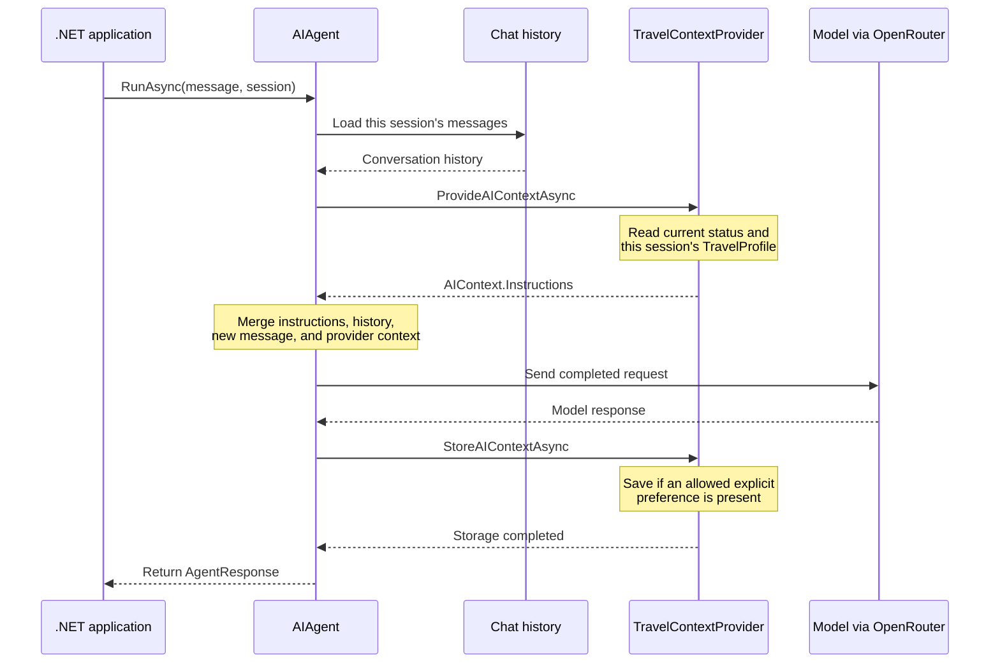

# Session 14 — Context and memory in one C# example

## The idea in one sentence

An `AIContextProvider` lets application code add fresh information before every agent request and save a small, selected piece of state after a successful request.

## What this example proves

The travel assistant makes four calls. Conversation A saves `transport=train`, then runs again after support status changes. A new conversation B begins without A's history or preference. The application then copies only the preference into B, which recalls it without receiving A's transcript.

The `[provider before]` and `[provider after]` console lines make this lifecycle visible.

## The problem it solves

A model knows only what reaches its request. It cannot automatically see a changed support status, an authenticated profile, or a fact selected during an earlier request.

Permanent base instructions are a poor home for changing facts. A function tool solves a different problem because the model chooses whether to call it. A registered context provider is proactive: application code runs it around every relevant invocation.

This lesson uses one provider for two jobs:

- **dynamic context:** read current support status before each model call;
- **selected memory:** retain one validated transport preference in session state.

It does not build general-purpose durable memory. The narrow behavior keeps the lifecycle visible.

## Mental model: prepare, run, learn

1. **Prepare:** read current application data and selected state.
2. **Run:** add that information to this request, then let the model answer.
3. **Learn:** after success, inspect the input and save only a permitted fact.

The provider does not retrain the model. It changes the information available to one invocation and the application state available to later invocations.

## Four kinds of information

| Information | Source | Lifetime here |
|---|---|---|
| Base instructions | `ChatOptions.Instructions` | Every run of this agent |
| Dynamic context | `getSupportStatus()` | Read again for each run |
| Conversation history | Chat-history provider using an `AgentSession` | Messages belonging to that session |
| Selected memory | `TravelProfile` in `ProviderSessionState<T>` | One value stored in that session |

History and memory share a session boundary here, but they are not the same data. History is an ordered transcript. `TravelProfile` is one application-selected fact.

## Important types and ownership

| Type or API | Owner | Job in this lesson |
|---|---|---|
| `AIAgent`, `AgentSession`, `AgentResponse` | Microsoft Agent Framework | Represent the agent, one conversation boundary, and a completed result. |
| `ChatClientAgentOptions` | Microsoft Agent Framework | Configures the agent and registers `AIContextProviders`. |
| `AIContextProvider`, `InvokingContext`, `InvokedContext` | Microsoft Agent Framework | Define the before/after lifecycle and its inputs. |
| `ProviderSessionState<T>` | Microsoft Agent Framework | Stores provider-owned state in a session under one key. |
| `IChatClient`, `ChatOptions`, `ChatMessage`, `ChatRole`, `AIContext` | Microsoft.Extensions.AI | Supply model-neutral chat abstractions and returned context. |
| `OpenAIClient`, `GetChatClient(model)` | OpenAI .NET SDK | Create an OpenAI-compatible client and select a model. |
| `AsIChatClient()` | Microsoft.Extensions.AI OpenAI integration | Adapt the OpenAI SDK client to `IChatClient`. |
| `AsAIAgent(...)` | Microsoft Agent Framework integration | Wrap the `IChatClient` as an agent. |
| `ApiKeyCredential` | System.ClientModel | Wrap the environment-provided API key. |
| `TravelContextProvider`, `TravelProfile` | This application | Supply live status and store one preference. |
| OpenRouter | External service | Routes requests from its compatible endpoint to `OPENROUTER_MODEL`. |

Several libraries meet in setup: the OpenAI SDK connects to OpenRouter, Microsoft.Extensions.AI supplies the common chat interface, and Agent Framework supplies the agent, sessions, and provider lifecycle.

## Request lifecycle



The before hook affects the current model request. The after hook completes before the awaited `RunAsync` returns, so saved state is available on the next application line.

## Complete execution flow

| Run | Session before run | Provider context | State after success |
|---|---|---|---|
| A1: remember `train` | A has no history or preference | Open support; no preference | A stores `train` |
| A2: recommend travel | A has its first exchange and `train` | Closed support; preference `train` | A remains `train` |
| B1: ask preference | B has blank history and state | Closed support; no preference | No preference; B gains its own exchange |
| B2: ask again | B has its own exchange and a copied profile | Closed support; preference `train` | B remains `train` |

The session passed to `RunAsync` is used by two separate mechanisms: chat history stores messages, while `ProviderSessionState<TravelProfile>` stores the profile. Copying a profile does not copy messages.

## Code walkthrough

The runnable file is [`Example/Program.cs`](Example/Program.cs). Follow its six numbered sections.

### Section 1: build the model client

```csharp
string apiKey = Environment.GetEnvironmentVariable("OPENROUTER_API_KEY")
    ?? throw new InvalidOperationException("OPENROUTER_API_KEY is not set.");
string model = Environment.GetEnvironmentVariable("OPENROUTER_MODEL")
    ?? throw new InvalidOperationException("OPENROUTER_MODEL is not set.");
```

Configuration stays outside source control. The null-coalescing throws stop immediately with a useful error instead of attempting a malformed request.

```csharp
IChatClient chatClient = new OpenAIClient(
        new ApiKeyCredential(apiKey),
        new OpenAIClientOptions { Endpoint = new Uri("https://openrouter.ai/api/v1") })
    .GetChatClient(model)
    .AsIChatClient();
```

Read the chain top to bottom:

1. `ApiKeyCredential` wraps the key for the OpenAI SDK.
2. `OpenAIClientOptions.Endpoint` points that SDK at OpenRouter's OpenAI-compatible endpoint.
3. `OpenAIClient` creates the SDK client; no network request happens yet.
4. `GetChatClient(model)` selects the configured model.
5. `AsIChatClient()` adapts it to Microsoft.Extensions.AI's provider-neutral interface.

The model is contacted later by `RunAsync`.

### Section 2: create and register one provider

```csharp
string supportStatus = "Travel support is open until 17:00 UTC.";
TravelContextProvider contextProvider = new(
    getSupportStatus: () => supportStatus);
```

The string represents live application data. The lambda supplies a function, not a one-time string copy. Calling it later reads the current variable value. A production application might read an authorized database record, API, or feature flag.

```csharp
AIAgent agent = chatClient.AsAIAgent(new ChatClientAgentOptions
{
    Name = "TravelAssistant",
    ChatOptions = new ChatOptions
    {
        Instructions =
            "You are a concise travel assistant. Use supplied application context when it is relevant. " +
            "Never claim that you remember a preference unless the context explicitly supplies it."
    },
    AIContextProviders = [contextProvider]
});
```

`AsAIAgent` creates the Agent Framework wrapper. `Name` is metadata. `ChatOptions.Instructions` supplies stable behavior for every run. `AIContextProviders` registers the provider once, after which the framework invokes it automatically.

Stable instructions describe behavior; the provider supplies facts that may change.

### Section 3: run conversation A and store one fact

```csharp
AgentSession conversationA = await agent.CreateSessionAsync();
AgentResponse saveResponse = await agent.RunAsync(
    "Remember preference: transport=train. Confirm briefly.",
    conversationA);
```

The session is A's boundary for both history and provider state. Passing it to `RunAsync` associates this message and response with A.

During the awaited call, the before hook finds no preference, the model answers, and the after hook parses and saves `train`. Only then does `RunAsync` return. Therefore the next line can immediately observe the value:

```csharp
TravelProfile savedProfile = contextProvider.GetProfile(conversationA);
Console.WriteLine($"Application memory: transport={savedProfile.PreferredTransport}");
```

The exchange is in A's history, but only `train` is in its `TravelProfile`.

### Section 4: collect dynamic context again

```csharp
supportStatus = "Travel support is closed; it reopens at 09:00 UTC.";
AgentResponse followUpResponse = await agent.RunAsync(
    "Recommend how I should travel and tell me whether support is available now.",
    conversationA);
```

The same session supplies A's first exchange and its saved `train` value. The before hook calls the delegate again and sees the new closed status. The request therefore combines conversation history, selected memory, and current application data.

### Section 5: separate history from reusable memory

```csharp
AgentSession conversationB = await agent.CreateSessionAsync();
AgentResponse blankMemoryResponse = await agent.RunAsync(
    "What transport do I prefer? Answer only from supplied context.",
    conversationB);
```

Before B's first run, its history and profile are blank. After the awaited call, B contains its own question and answer, but none of A's transcript or state.

```csharp
contextProvider.SetProfile(conversationB, savedProfile);
AgentResponse recalledResponse = await agent.RunAsync(
    "What transport do I prefer? Answer only from supplied context.",
    conversationB);
```

`SetProfile` constructs a new `TravelProfile` containing only the selected string. It neither shares A's profile object nor moves A's messages. B's second run now receives `train` from B's provider state while retaining only B's history.

This manual copy exposes the boundary. A real system would normally load an authorized user profile from durable storage.

### Section 6a: own one session-state key

```csharp
_profiles = new ProviderSessionState<TravelProfile>(
    _ => new TravelProfile(),
    stateKey: nameof(TravelContextProvider));

public override IReadOnlyList<string> StateKeys => [_profiles.StateKey];
```

`ProviderSessionState<T>` initializes a blank profile and stores it in each session's state bag under `TravelContextProvider`. `_profiles.StateKey` is the actual key. The `StateKeys` override reports ownership to Agent Framework so it can detect key conflicts and handle provider-owned session state.

`GetProfile` reads or initializes one session's profile. `SetProfile` saves a new object so the sessions do not share one profile reference.

### Section 6b: retrieve before the model call

```csharp
TravelProfile profile = _profiles.GetOrInitializeState(context.Session);
string currentSupportStatus = _getSupportStatus();
string rememberedPreference = profile.PreferredTransport is null
    ? "No transport preference is stored for this conversation."
    : $"The user's remembered transport preference is {profile.PreferredTransport}.";

return new ValueTask<AIContext>(new AIContext
{
    Instructions = $"Trusted application context:\n- {currentSupportStatus}\n- {rememberedPreference}"
});
```

`ProvideAIContextAsync` receives an `InvokingContext`. It reads only that session's profile, calls the status delegate once for a consistent snapshot, and returns additional instructions. The framework merges them into this invocation; it does not permanently modify the base `ChatOptions.Instructions`.

`Trusted` is an assertion by this demo, not validation performed by the framework. External data must be authorized, validated, minimized, and protected against indirect prompt injection before injection.

### Section 6c: parse and save after success

```csharp
foreach (ChatMessage message in
    context.RequestMessages.Where(m => m.Role == ChatRole.User))
{
    string text = message.Text?.Trim() ?? string.Empty;
    int prefixIndex = text.IndexOf(
        PreferencePrefix,
        StringComparison.OrdinalIgnoreCase);

    if (prefixIndex < 0) continue;

    string value = text[(prefixIndex + PreferencePrefix.Length)..]
        .Split(['.', ',', ';'], 2)[0]
        .Trim();
    string normalizedValue = value.ToLowerInvariant();

    if (normalizedValue is "train" or "plane" or "car")
    {
        TravelProfile updatedProfile = new()
        {
            PreferredTransport = normalizedValue
        };
        _profiles.SaveState(context.Session, updatedProfile);
    }
}
```

`StoreAIContextAsync` receives an `InvokedContext` after the model responds. The base provider lifecycle first applies its configured message-source filtering; with this example's defaults, the relevant input is the external request. The example additionally keeps user-role messages.

The parser deliberately performs eight mechanical steps:

1. safely obtain and trim the text;
2. search case-insensitively for `Remember preference: transport=`;
3. skip a message without it;
4. slice immediately after the prefix;
5. stop at the first period, comma, or semicolon;
6. trim and normalize to lowercase;
7. accept only `train`, `plane`, or `car`;
8. create and save a new profile for the current session.

`IndexOf` permits the prefix anywhere in the message, not only at the beginning. This is narrow deterministic demo syntax, not comprehensive validation or natural-language memory extraction. The program does not trust model prose or make another model call to choose memories.

The base class skips `StoreAIContextAsync` after a failed invocation, so this example does not save a preference from a failed run.

## Nullable sessions and stateless calls

Lifecycle contexts expose a nullable `Session` because providers can run through paths that do not supply one. Every call here explicitly passes a created session.

At the helper level, `GetOrInitializeState(null)` returns an unpersisted default and `SaveState(null, ...)` does nothing. A stateful provider should deliberately require a session or intentionally support stateless behavior; it should not assume persistence happened.

## What happens inside Agent Framework

The framework loads session history and invokes registered context providers in order. A provider can contribute instructions, messages, or tools through `AIContext`. The framework combines those contributions with the request before calling the model.

Afterward, providers receive request messages, response messages, the session, and failure information. The base implementation calls this storage override only after success. History and provider state can both travel with a serialized session, but remain separate values with separate responsibilities.

Injected context consumes tokens, and external retrieval may add latency. Return focused information rather than an unbounded profile or transcript.

## Expected output

Model prose varies. These provider and application-state lines are deterministic:

```text
=== CONVERSATION A: SAVE ONE PREFERENCE ===
[provider before] Travel support is open until 17:00 UTC. No transport preference is stored for this conversation.
[provider after] Stored transport preference: train
Agent: I'll remember that you prefer train travel.
Application memory: transport=train

[provider before] Travel support is closed; it reopens at 09:00 UTC. The user's remembered transport preference is train.
=== SAME CONVERSATION: HISTORY + CONTEXT + MEMORY ===
Agent: I recommend travelling by train. Support is currently closed...

=== CONVERSATION B: FIRST RUN WITHOUT A'S HISTORY OR MEMORY ===
[provider before] ... No transport preference is stored for this conversation.
Agent: No transport preference is supplied.

=== CONVERSATION B: OWN HISTORY, COPIED MEMORY VALUE ===
[provider before] ... The user's remembered transport preference is train.
Agent: You prefer train travel.
```

Run it with:

```powershell
$env:OPENROUTER_API_KEY = "your-key"
$env:OPENROUTER_MODEL = "your-model"
dotnet run --project lessons/14-context-and-memory-complete-guide/Example
```

## When to use it

Use a context provider when application-controlled information should be assembled proactively—for example current account status, an authorized profile, selected memories, or retrieved knowledge.

## When not to use it

Use a function tool when the model should decide whether and when to perform an on-demand lookup or action. Do not inject large irrelevant datasets, unvalidated content, or unnecessary secrets. Do not call a whole transcript “memory” when the application needs one stable fact.

## Recap

- The before hook retrieves fresh context and selected session state.
- Agent Framework merges returned `AIContext` into the current request.
- The after hook saves an explicitly selected fact after success.
- History is a session transcript; this memory is one application-owned value.
- A new session starts separately, so reusable memory must be deliberately loaded.

## Next lesson

Session 15 begins the RAG mini-series with the same before-the-model idea: retrieve relevant knowledge, add it to the request, and generate a grounded response.
