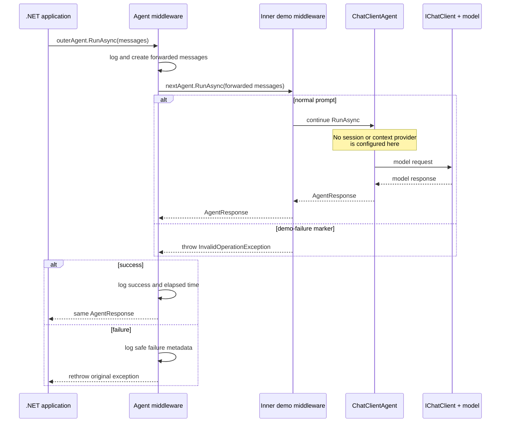

# Session 25 — Agent middleware and the execution pipeline

## The idea in one sentence

Agent middleware wraps an `AIAgent` run so one reusable delegate can inspect or change the request before the inner agent and observe the response or exception afterward.

## The problem it solves

Logging, timing, validation, request policies, and failure diagnostics often apply to every agent run. Copying those concerns into every prompt or call site mixes infrastructure behavior with the agent's actual job and makes it easy for one path to behave differently.

Middleware creates one boundary around the run. The application calls the outer agent, the middleware decides what to forward, and the next inner layer continues execution. Depending on configuration, deeper layers may include more middleware, session history, context providers, the chat client, and the model. This example uses a second tiny middleware only to generate a downstream failure; it configures no session or context provider.

This lesson uses one delegate to demonstrate four related behaviors:

- log safe request metadata before the run;
- add one fixed developer-owned request instruction;
- log success after the inner agent returns;
- observe cancellation or failure and rethrow it unchanged.

## Mental model: a wrapper around a method call

For a .NET developer, agent middleware is similar to ASP.NET Core middleware or a decorator:

```text
before work
    response = await next(...)
after work
return response
```

The code before `await` runs on the way in. Code after `await` runs on the way out. A `try/catch` around `await nextAgent.RunAsync(...)` can observe exceptions from the inner pipeline.

## Important types and ownership

| Type | Owner | Job in this lesson |
|---|---|---|
| `AIAgent` | Microsoft Agent Framework | Represents both the inner agent and the completed outer pipeline. |
| `AIAgentBuilder` | Microsoft Agent Framework | Wraps an agent with registered middleware and builds the pipeline. |
| `AgentResponse`, `AgentSession`, `AgentRunOptions` | Microsoft Agent Framework | Carry the result, optional conversation, and run configuration through the wrapper. |
| `ChatMessage`, `ChatRole`, `IChatClient` | Microsoft.Extensions.AI | Represent request messages, message roles, and the chat-client abstraction. |
| `TraceAndPolicyMiddleware` | This example | Logs, adds one fixed instruction, calls the inner agent, and preserves failures. |
| `Stopwatch` | .NET (`System.Diagnostics`) | Measures elapsed time around the inner call. |
| `OpenAIClient` | OpenAI .NET SDK | Connects to OpenRouter's OpenAI-compatible endpoint. |
| `ApiKeyCredential` | System.ClientModel | Wraps the key read from the environment. |
| OpenRouter | External service | Routes successful model requests to `OPENROUTER_MODEL`. |

There is no required `IMiddleware` class in this example. Agent Framework registers middleware through a function callback with the shape expected by `AIAgentBuilder.Use`.

## Where middleware sits



Both wrappers in the diagram are agent-run middleware. The inner one is only deterministic tutorial scaffolding. Function middleware and `IChatClient` middleware exist at narrower scopes, while optional history and context-provider work occurs inside a configured chat-client agent; none is configured for these two calls.

## Complete execution flow

1. The program creates an OpenRouter-backed `IChatClient` and an ordinary inner agent.
2. `innerAgent.AsBuilder()` creates an `AIAgentBuilder` around that agent.
3. The first `.Use(...)` registers `TraceAndPolicyMiddleware` as the outermost delegate.
4. The second `.Use(...)` registers `DemoFailureMiddleware` immediately inside it.
5. `.Build()` returns the outer `AIAgent` that application code calls.
6. The outer middleware materializes the incoming messages once, creates a request ID, starts a timer, and logs the message count.
7. It builds a new message list containing a fixed system instruction followed by the original message objects.
8. `nextAgent.RunAsync(...)` continues to the inner demo middleware while forwarding the session, run options, and cancellation token.
9. The normal prompt continues to the chat-client agent and model; the marker prompt throws in the inner demo middleware.
10. On success, the outer middleware logs elapsed time and returns the inner `AgentResponse` unchanged.
11. On cancellation or another exception, it logs safe metadata and rethrows with `throw;`.

## Code walkthrough

The complete runnable example is in [`Example/Program.cs`](Example/Program.cs). Its five section comments are the recording order.

### 1. Keep the original agent focused

```csharp
AIAgent innerAgent = chatClient.AsAIAgent(
    instructions: "You are a practical assistant for C# developers.",
    name: "DeveloperAssistant");
```

The inner agent still owns its actual role. It knows nothing about request IDs, timing, failure logging, or the two-sentence policy added by the wrapper.

### 2. Build the middleware pipeline

```csharp
AIAgent agent = innerAgent
    .AsBuilder()
    .Use(TraceAndPolicyMiddleware, runStreamingFunc: null)
    .Use(DemoFailureMiddleware, runStreamingFunc: null)
    .Build();
```

`AsBuilder()` is an Agent Framework extension that uses the existing agent as the pipeline's innermost component. Each `Use` registers a run callback. The first registered callback becomes outermost, so `TraceAndPolicyMiddleware` can observe the demo layer. `Build` produces another `AIAgent`, so callers continue to use the familiar `RunAsync` API.

This lesson calls only `RunAsync`. Because the streaming delegate is `null`, the framework can adapt this batch callback if someone calls `RunStreamingAsync`, but that produces limited/buffered streaming behavior. A real streaming pipeline should implement and test a streaming-specific delegate.

### 3. Observe the request without logging its content

```csharp
List<ChatMessage> originalMessages = messages.ToList();

Console.WriteLine(
    $"[middleware before] id={requestId} messages={originalMessages.Count}");
```

The input is `IEnumerable<ChatMessage>`, which may be evaluated lazily. Materializing it once prevents repeated enumeration from behaving differently, at the cost of one list allocation. This is a deliberate tutorial tradeoff rather than a universal middleware requirement. The log records a generated identifier and count, not prompts, secrets, or full provider payloads.

The short request ID is useful only for this console demonstration. Production correlation should use the application's tracing or logging system rather than treating eight random hexadecimal characters as a globally guaranteed identifier.

### 4. Change the request deliberately

```csharp
List<ChatMessage> forwardedMessages =
[
    new ChatMessage(
        ChatRole.System,
        "Middleware policy: keep the final answer to no more than two short sentences."),
    .. originalMessages
];
```

The middleware creates a new list rather than modifying the input collection or its messages. The added instruction is fixed, developer-owned text. A system message has high influence, so raw user text must never be promoted to this role. The inner chat-client agent also has configured instructions; provider/model handling of multiple instruction sources must be tested rather than assuming this inserted message is the sole or final policy.

Request modification affects every run through this built agent. It can change behavior, token usage, safety, caching, and evaluation results. Keep changes small, documented, and covered by tests.

### 5. Continue the pipeline

```csharp
AgentResponse innerResponse = await nextAgent.RunAsync(
    forwardedMessages,
    session,
    options,
    cancellationToken);
```

Calling the supplied `nextAgent` is what continues execution. Middleware can intentionally short-circuit by returning its own response, but this example always delegates on the normal path. It forwards the same optional session, options, and cancellation token so the wrapper does not silently change conversation or cancellation semantics.

### 6. Run code after success

```csharp
Console.WriteLine(
    $"[middleware after] id={requestId} success=true " +
    $"elapsedMs={stopwatch.ElapsedMilliseconds}");

return innerResponse;
```

This line runs only after the inner task completes successfully. The exact `AgentResponse` returned by the inner agent goes back to the application; this middleware does not rewrite it.

### 7. Preserve cancellation and exceptions

```csharp
catch (OperationCanceledException)
    when (cancellationToken.IsCancellationRequested)
{
    Console.WriteLine($"[middleware canceled] ...");
    throw;
}
catch (Exception exception)
{
    Console.WriteLine($"[middleware error] ... type={exception.GetType().Name}");
    throw;
}
```

Cancellation is logged separately because a caller-requested cancellation is not the same as an unexpected provider failure. Both handlers use bare `throw;`, which rethrows the current exception while preserving its stack. Creating a replacement exception or using `throw exception;` would change diagnostic information.

The catch filter applies only when the supplied cancellation token is requested. An `OperationCanceledException` while that token is not requested falls through to the general exception handler.

The application remains responsible for deciding whether to retry, show a fallback, return an error, or stop. Middleware should not silently hide failure unless a deliberate and tested fallback policy requires that behavior.

### 8. Make a downstream failure reproducible

```csharp
if (forwardedMessages.Any(message =>
    message.Text.Contains("[demo-failure]", StringComparison.Ordinal)))
{
    throw new InvalidOperationException(
        "Demonstration failure inside the inner pipeline.");
}
```

This code lives in the second, inner middleware. The marker is tutorial scaffolding, not a recommended prompt-triggered production policy. The visible order proves that the outer middleware changes the request, calls `nextAgent`, observes the inner exception on the way out, and rethrows it without spending a model request. Real downstream failures may instead come from the agent or model provider.

## What happens inside Agent Framework

`AIAgentBuilder` stores factories for intermediate agents. During `Build`, it applies them in reverse construction order so the first middleware registered becomes the outermost wrapper. The callback overload used here creates an internal delegating agent whose non-streaming run implementation invokes `TraceAndPolicyMiddleware` with the current inputs and the inner agent.

With the two callbacks registered here, their normal order is:

```text
first before → second before → inner agent → second after → first after
```

If an inner layer throws, successful “after” code is skipped while outer `catch` or `finally` blocks can observe the failure. If middleware never calls the inner agent, it short-circuits the remaining pipeline.

## Expected output

The generated answer, request ID, and elapsed time vary. The control flow should resemble:

```text
=== SUCCESSFUL RUN ===
[middleware before] id=91c7a0e2 messages=1
[middleware change] id=91c7a0e2 added=fixed-length-policy
[middleware after] id=91c7a0e2 success=true elapsedMs=842
Application received: Dependency injection separates object creation...

=== FAILURE RUN ===
[middleware before] id=67fbe213 messages=1
[middleware change] id=67fbe213 added=fixed-length-policy
[inner demo middleware] throwing deterministic failure
[middleware error] id=67fbe213 type=InvalidOperationException elapsedMs=0
Application caught: InvalidOperationException: Demonstration failure inside the inner pipeline.
```

The console visibly proves preservation of the exception type and message. Preservation of the active exception and stack comes from the C# semantics of bare `throw;`, not from these printed lines.

Run it with:

```powershell
$env:OPENROUTER_API_KEY = "your-key"
$env:OPENROUTER_MODEL = "your-model"
dotnet run --project lessons/25-agent-middleware-complete-guide/Example
```

## When to use it

Use agent-run middleware for cross-cutting behavior around whole runs: logging, tracing, timing, authorization checks, rate limits, validation, consistent error policies, and carefully controlled request/response transformation.

## When not to use it

Use a context provider when the primary job is proactively retrieving knowledge or memory for the model. Use function middleware when the concern surrounds individual tool calls. Use `IChatClient` middleware when it must surround each lower-level model call. Do not hide core business logic in a generic wrapper or log sensitive prompts by default.

## Recap

- Agent middleware is an outer `AIAgent` wrapper built with `AIAgentBuilder`.
- Code before the inner call observes or changes the request.
- Code after the awaited call observes success and the response.
- A `try/catch` can observe inner failures; bare `throw;` preserves them.
- Request changes and exception recovery are powerful policies that require explicit trust and tests.

## Next lesson

Session 26 asks whether a task needs one agent or an explicit workflow before building the first two-step workflow.
